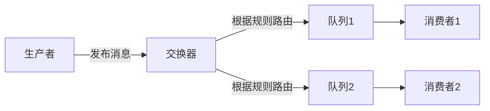
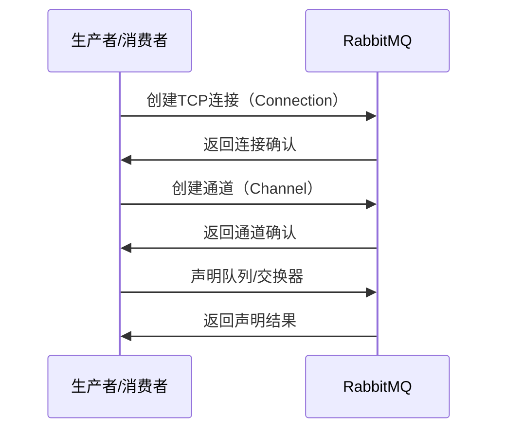
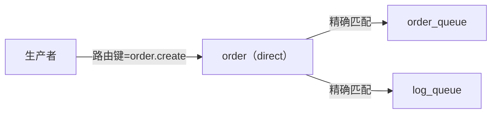
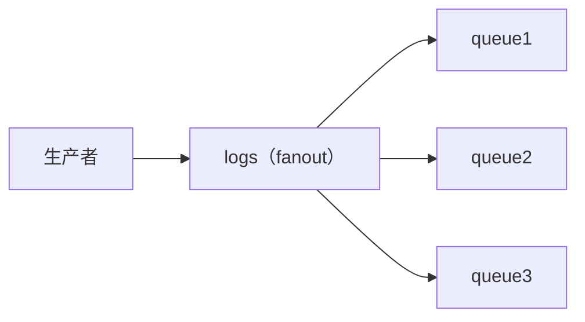
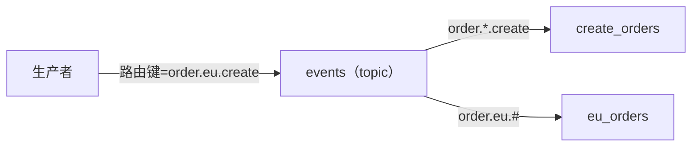

# RabbitMQ 工作流程详解

## 一、核心组件与工作流程

### 1. RabbitMQ 核心架构



### 2. 详细工作流程

1. **生产者**将消息发送到**交换器(Exchange)**
2. 交换器根据**绑定规则**和**路由键**将消息分发到**队列(Queue)**
3. **队列**将消息存储在内存或磁盘中
4. **消费者**从队列中获取消息并处理
5. 消费者发送**确认回执**(ACK)给RabbitMQ
6. RabbitMQ从队列中删除已被确认的消息

## 二、各组件物理位置

### 1. 队列(Queue)的位置
- **物理位置**：位于RabbitMQ服务器内存/磁盘中
- **存储内容**：
  - 消息内容
  - 消息属性
  - 元数据（如优先级、延迟设置等）
- **持久化**：
  - 持久化队列：消息存盘，服务器重启后仍存在
  - 临时队列：仅存内存，服务器重启后消失

### 2. 生产者位置
- **部署位置**：
  - 通常位于独立的应用程序服务器
  - 可以是Web服务、后台任务、微服务等
- **连接方式**：
  - 通过TCP连接（默认端口5672）连接到RabbitMQ服务器
  - 使用AMQP协议通信

### 3. 消费者位置
- **部署位置**：
  - 独立于生产者的服务/进程
  - 常见部署形式：
    - 后台守护进程
    - 微服务实例
    - Kubernetes Pod
- **连接方式**：
  - 同样通过TCP连接RabbitMQ服务器
  - 长连接保持监听队列

## 三、连接机制详解

### 1. 连接建立过程



### 2. 连接要素

| 要素        | 说明                  | 生产者和消费者是否相同 |
| ----------- | --------------------- | ---------------------- |
| 主机地址    | RabbitMQ服务器IP/域名 | 是                     |
| 端口        | 默认5672（AMQP）      | 是                     |
| 虚拟主机    | 类似命名空间（默认/） | 是                     |
| 用户名/密码 | 认证凭据              | 是                     |
| 心跳        | 保持连接活性          | 是                     |

### 3. 通道(Channel)的作用
- **复用连接**：单个TCP连接上创建多个轻量级通道
- **隔离操作**：每个通道有独立的状态和事务
- **性能优化**：避免频繁创建TCP连接的开销

## 四、消息流转示例

### 1. 生产者发送消息流程

```java
// 1. 创建连接
ConnectionFactory factory = new ConnectionFactory();
factory.setHost("rabbitmq.example.com");
Connection connection = factory.newConnection();

// 2. 创建通道
Channel channel = connection.createChannel();

// 3. 声明交换器（如果不存在）
channel.exchangeDeclare("orders", "direct", true);

// 4. 发布消息
channel.basicPublish(
    "orders",          // 交换器名称
    "order.create",    // 路由键
    MessageProperties.PERSISTENT_TEXT_PLAIN,
    "订单数据".getBytes()
);
```

### 2. 消费者接收消息流程

```java
// 1. 创建连接和通道（同生产者）

// 2. 声明队列并绑定
channel.queueDeclare("order_queue", true, false, false, null);
channel.queueBind("order_queue", "orders", "order.create");

// 3. 设置消费者
channel.basicConsume("order_queue", false, (consumerTag, delivery) -> {
    // 处理消息
    String message = new String(delivery.getBody(), "UTF-8");
    System.out.println("收到订单: " + message);
    
    // 确认消息
    channel.basicAck(delivery.getEnvelope().getDeliveryTag(), false);
}, consumerTag -> {});
```

## 五、不同交换器类型的工作流程

### 1. 直连(Direct)交换器



### 2. 扇形(Fanout)交换器



### 3. 主题(Topic)交换器



## 六、持久化与可靠性

### 1. 消息持久化设置

| 组件   | 持久化方法                                  | 效果                   |
| ------ | ------------------------------------------- | ---------------------- |
| 队列   | `channel.queueDeclare(name, true, ...)`     | 服务器重启后队列仍存在 |
| 消息   | `MessageProperties.PERSISTENT_TEXT_PLAIN`   | 消息写入磁盘           |
| 交换器 | `channel.exchangeDeclare(name, type, true)` | 交换器配置持久化       |

### 2. 可靠性保障措施

1. **生产者确认模式**：
   ```java
   channel.confirmSelect(); // 启用确认模式
   channel.addConfirmListener(...); // 添加确认监听器
   ```

2. **消费者手动ACK**：
   ```java
   channel.basicConsume(queue, false, callback); // autoAck=false
   channel.basicAck(deliveryTag, false); // 处理完成后手动确认
   ```

3. **备用交换器**：
   ```java
   Map<String, Object> args = new HashMap<>();
   args.put("alternate-exchange", "my-ae");
   channel.exchangeDeclare("main-exchange", "direct", false, false, args);
   ```

## 七、常见部署拓扑

### 1. 单节点部署

```
[生产者1] [生产者2]
       \ /
    [RabbitMQ]
       / \
[消费者1] [消费者2]
```

### 2. 集群部署

```
[生产者] ---> [RabbitMQ节点1] <---> [RabbitMQ节点2] <---> [RabbitMQ节点3]
                     ^
                     |
               [消费者集群]
```

### 3. 联邦部署（跨机房）

```
[机房A生产者] --> [RabbitMQ集群A] <--联邦--> [RabbitMQ集群B] <-- [机房B消费者]
```

## 八、关键问题解答

### Q1：队列在RabbitMQ中是如何存储的？
A：队列及其消息默认存储在内存中，但可以配置为：
- **持久化队列**：元数据存盘，消息根据delivery mode决定
- **临时队列**：完全内存存储，连接断开后自动删除

### Q2：生产者和消费者必须同时在线吗？
A：不需要，RabbitMQ作为中间人：
- 生产者发送消息时，消费者可以离线（消息会存储在队列中）
- 消费者可以随时连接处理积压消息
- 典型解耦特性：生产者和消费者生命周期完全独立

### Q3：RabbitMQ如何保证消息不丢失？
A：通过多重机制保障：
1. 持久化设置（队列+消息）
2. 生产者确认（publisher confirms）
3. 消费者手动ACK
4. 集群镜像队列（HA）

### Q4：大量消息积压时会发生什么？
A：取决于配置：
- 内存警告：当内存使用超过阈值（默认40%），阻塞生产者
- 持久化：大量消息会导致磁盘I/O增加
- 队列长度限制：可通过`x-max-length`参数限制

RabbitMQ的工作流程设计完美体现了消息代理的核心价值：**系统解耦**、**异步通信**和**流量削峰**。理解这些基础原理后，可以根据实际业务需求设计出合理的消息架构。

