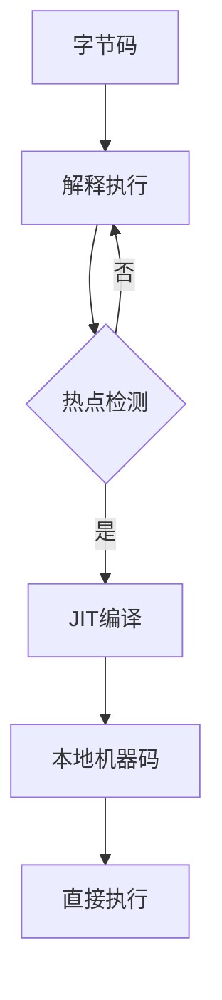

# JIT（即时编译）技术深度解析

JIT（Just-In-Time）编译是Java虚拟机（JVM）性能优化的核心技术之一，它通过在运行时将热点代码编译为本地机器码，显著提升程序的执行效率。下面我将从工作原理、优化技术、实现细节等多个维度全面解析JIT编译器。

## 一、JIT基础概念

### 1. 为什么需要JIT？

Java程序最初是通过解释器（Interpreter）逐条执行字节码的，这种方式存在明显性能瓶颈：

| 执行方式        | 优点                   | 缺点                               |
| --------------- | ---------------------- | ---------------------------------- |
| 解释执行        | 快速启动               | 执行效率低（比本地代码慢10-100倍） |
| 静态编译（AOT） | 执行快                 | 失去跨平台性，无法做运行时优化     |
| JIT编译         | 兼顾启动速度和执行效率 | 需要运行时分析开销                 |

JIT的诞生完美解决了这个矛盾，实现了"写一次，到处运行"的同时获得接近本地代码的执行效率。

### 2. JIT工作流程

mermaid

复制



## 二、HotSpot JIT实现详解

### 1. 热点代码检测

HotSpot采用**计数器**方式识别热点代码：

- 

  方法调用计数器

  （Invocation Counter）

  - 默认阈值：Client模式1500次，Server模式10000次
  - 参数：`-XX:CompileThreshold`

- 

  回边计数器

  （Back Edge Counter）

  - 统计循环次数
  - 触发OSR（On-Stack Replacement）

**热点检测算法**：

java

复制

```java
// 简化的热点检测逻辑
if (method.invocationCount++ > threshold 
    || method.backEdgeCount > backEdgeThreshold) {
    compileMethod(method);
}
```

### 2. 分层编译（Tiered Compilation）

现代JVM采用多级编译策略：

| 层级 | 编译方式   | 优化程度 | 启用参数 |
| ---- | ---------- | -------- | -------- |
| 0    | 解释执行   | 无       | 默认     |
| 1    | C1简单编译 | 少量优化 | -client  |
| 2    | C1受限编译 | 基础优化 | -client  |
| 3    | C1完全编译 | 全面优化 | -client  |
| 4    | C2编译     | 激进优化 | -server  |

**混合模式示例**：

bash

复制

```bash
java -XX:+TieredCompilation -XX:TieredStopAtLevel=3 MyApp
```

### 3. 主要JIT编译器

#### C1编译器（Client Compiler）

- 特点：
  - 编译速度快
  - 优化程度较低
  - 适合GUI等客户端应用
- 主要优化：
  - 方法内联
  - 去虚拟化
  - 有限的内存分配优化

#### C2编译器（Server Compiler）

- 特点：
  - 编译速度慢
  - 深度优化
  - 适合长时间运行的服务器应用
- 主要优化：
  - 激进的内联策略
  - 逃逸分析
  - 锁消除
  - 向量化运算

#### Graal编译器（Java 10+）

- 特点：

  - 用Java编写的JIT编译器
  - 支持更多高级优化
  - 可作为C2的替代品

- 启用方式：

  bash

  复制

  ```bash
  -XX:+UnlockExperimentalVMOptions -XX:+UseJVMCICompiler
  ```

## 三、JIT核心优化技术

### 1. 方法内联（Inlining）

**原理**：
 将小方法体直接嵌入调用处，减少方法调用开销

**示例**：

java

复制

```java
// 内联前
int result = square(5);

int square(int x) {
    return x * x;
}

// 内联后等效代码
int result = 5 * 5;
```

**优化条件**：

- 方法体较小（默认35字节，可通过`-XX:MaxInlineSize`调整）
- 热点方法（调用频繁）
- 非虚方法（或通过类型分析可确定的具体实现）

### 2. 逃逸分析（Escape Analysis）

**原理**：
 分析对象动态作用域，判断是否：

- 仅当前线程使用（线程逃逸）
- 仅当前方法使用（方法逃逸）
- 被其他方法/线程引用（全局逃逸）

**优化应用**：

1. **栈上分配**：

   java

   复制

   ```java
   // 可能被优化为栈分配
   void method() {
       Object localObj = new Object();
       // 仅本地使用
   }
   ```

2. **锁消除**：

   java

   复制

   ```java
   // 锁可能被消除
   synchronized(new Object()) {
       // 无竞争的操作
   }
   ```

3. **标量替换**：

   java

   复制

   ```java
   // Point对象可能被拆解为两个局部变量
   Point p = new Point(x, y);
   return p.x + p.y;
   ```

### 3. 循环优化

**常见优化手段**：

- 循环展开（Loop Unrolling）

  java

  复制

  ```java
  // 优化前
  for (int i = 0; i < 4; i++) {
      sum += arr[i];
  }
  
  // 优化后等效代码
  sum += arr[0];
  sum += arr[1];
  sum += arr[2];
  sum += arr[3];
  ```

- 循环剥离（Loop Peeling）

- 循环交换（Loop Interchange）

- 循环版本控制（Loop Versioning）

### 4. 其他重要优化

1. **分支预测**：

   - 基于历史执行统计预测分支走向
   - 优化条件判断逻辑

2. **虚方法去虚拟化**：

   java

   复制

   ```java
   // 可能优化为直接调用
   interface Animal { void speak(); }
   class Cat implements Animal { void speak() { meow(); } }
   
   Animal a = new Cat();
   a.speak(); // 可能直接调用Cat.speak()
   ```

3. **内联缓存**：

   - 缓存虚方法调用的具体实现
   - 减少虚方法表查找开销

## 四、JIT监控与调优

### 1. 查看JIT编译情况

bash

复制

```bash
# 打印编译日志
-XX:+PrintCompilation

# 输出详细编译信息
-XX:+UnlockDiagnosticVMOptions -XX:+LogCompilation -XX:+PrintInlining
```

**典型输出**：

markdown

复制

```markdown
% java -XX:+PrintCompilation
  42    1       java.lang.String::hashCode (55 bytes)
  43    2       java.lang.String::charAt (29 bytes)
  45    3       java.util.HashMap::get (60 bytes)
```

### 2. 关键性能参数

| 参数                       | 说明                 | 推荐值              |
| -------------------------- | -------------------- | ------------------- |
| `-XX:CompileThreshold`     | 触发编译的调用次数   | 默认10000（Server） |
| `-XX:MaxInlineSize`        | 方法内联最大字节数   | 35                  |
| `-XX:FreqInlineSize`       | 热点方法内联大小     | 325                 |
| `-XX:MinInliningThreshold` | 方法内联最小调用次数 | 250                 |

### 3. 优化建议

1. **预热期设计**：

   java

   复制

   ```java
   // 在正式处理前先执行核心逻辑
   for (int i = 0; i < 10000; i++) {
       processSampleRequest();
   }
   ```

2. **方法设计**：

   - 热点方法保持短小
   - 减少虚方法调用
   - 避免大对象分配

3. **循环优化**：

   - 使用固定次数的循环
   - 避免循环内复杂条件判断

## 五、JIT与AOT对比

| 特性     | JIT            | AOT（如GraalVM Native Image） |
| -------- | -------------- | ----------------------------- |
| 启动速度 | 中等           | 极快                          |
| 峰值性能 | 高             | 中等                          |
| 内存占用 | 较高           | 低                            |
| 优化潜力 | 运行时优化     | 有限静态优化                  |
| 适用场景 | 长时间运行应用 | 短生命周期应用                |

## 六、最新发展

1. **Profile-Guided Optimization (PGO)**：
   - 基于运行时profile数据的优化
   - Java 9+支持
2. **JVMCI (Java-Level JVM Compiler Interface)**：
   - 允许用Java实现编译器（如Graal）
   - Java 9引入
3. **Vector API**：
   - 支持SIMD指令优化
   - 需要JIT配合实现

## 七、常见问题解答

### Q1：为什么我的热点方法没有被编译？

可能原因：

- 调用次数未达阈值（`-XX:CompileThreshold`）
- 方法体过大（超过`-XX:MaxInlineSize`）
- 包含JNI调用等不可优化操作

检查方法：

bash

复制

```bash
-XX:+PrintCompilation -XX:+UnlockDiagnosticVMOptions -XX:+PrintInlining
```

### Q2：如何避免JIT编译引起的停顿？

解决方案：

1. 使用`-XX:+BackgroundCompilation`（后台编译）
2. 提前预热关键路径
3. 考虑使用Graal原生镜像（AOT）

### Q3：JIT编译结果会失效吗？

会，在以下情况触发**去优化**（Deoptimization）：

1. 类型假设被推翻（如去虚拟化失败）
2. 逃逸分析假设不成立
3. 代码缓存满需要回收

查看去优化情况：

bash

复制

```bash
-XX:+TraceDeoptimization
```

## 总结

JIT编译技术通过：

1. **智能热点检测**：识别关键执行路径
2. **深度优化**：方法内联、逃逸分析等
3. **自适应编译**：分层编译策略

使得Java在保持跨平台特性的同时，获得了接近本地代码的执行效率。理解JIT工作原理对于编写高性能Java代码和进行JVM调优至关重要。随着Graal等新技术的发展，JIT编译仍在持续进化，为Java生态注入新的活力。