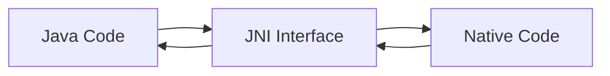

# JNI（Java Native Interface）深度解析

JNI是Java Native Interface的缩写，它提供了Java与本地代码（如C/C++）相互调用的标准机制。下面我将从基础概念到高级应用全面讲解JNI技术。

## 一、JNI基础概念

### 1. 为什么需要JNI？

| 场景         | 解决方案            |
| ------------ | ------------------- |
| 性能关键代码 | 本地代码执行更快    |
| 硬件访问     | 直接操作硬件设备    |
| 遗留系统集成 | 复用现有本地库      |
| 平台特定功能 | 访问操作系统特有API |

### 2. JNI工作原理

mermaid

复制



## 二、JNI开发流程

### 1. 编写Java本地方法

java

复制

```java
public class NativeDemo {
    // 声明native方法
    public native void printMessage(String msg);
    
    // 加载本地库
    static {
        System.loadLibrary("native-demo");
    }
    
    public static void main(String[] args) {
        new NativeDemo().printMessage("Hello JNI!");
    }
}
```

### 2. 生成头文件

bash

复制

```bash
javac -h . NativeDemo.java
```

生成的头文件示例（NativeDemo.h）：

c

复制

```c
/* DO NOT EDIT THIS FILE - it is machine generated */
#include <jni.h>
/* Header for class NativeDemo */

#ifndef _Included_NativeDemo
#define _Included_NativeDemo
#ifdef __cplusplus
extern "C" {
#endif
/*
 * Class:     NativeDemo
 * Method:    printMessage
 * Signature: (Ljava/lang/String;)V
 */
JNIEXPORT void JNICALL Java_NativeDemo_printMessage
  (JNIEnv *, jobject, jstring);

#ifdef __cplusplus
}
#endif
#endif
```

### 3. 实现本地方法

NativeDemo.c：

c

复制

```c
#include <stdio.h>
#include "NativeDemo.h"

JNIEXPORT void JNICALL Java_NativeDemo_printMessage
  (JNIEnv *env, jobject obj, jstring msg) {
  
    // 将jstring转换为C字符串
    const char *str = (*env)->GetStringUTFChars(env, msg, 0);
    
    printf("Native Message: %s\n", str);
    
    // 释放字符串资源
    (*env)->ReleaseStringUTFChars(env, msg, str);
}
```

### 4. 编译本地库

#### Linux/macOS:

bash

复制

```bash
gcc -shared -fpic -I${JAVA_HOME}/include -I${JAVA_HOME}/include/linux \
    -o libnative-demo.so NativeDemo.c
```

#### Windows:

cmd

复制

```cmd
cl -I"%JAVA_HOME%\include" -I"%JAVA_HOME%\include\win32" -LD NativeDemo.c -Fenative-demo.dll
```

## 三、JNI核心机制

### 1. 数据类型映射

| Java类型 | JNI类型  | C类型          |
| -------- | -------- | -------------- |
| boolean  | jboolean | unsigned char  |
| byte     | jbyte    | signed char    |
| char     | jchar    | unsigned short |
| short    | jshort   | short          |
| int      | jint     | int            |
| long     | jlong    | long long      |
| float    | jfloat   | float          |
| double   | jdouble  | double         |
| Object   | jobject  | void*          |

### 2. JNIEnv指针

`JNIEnv`是JNI的核心结构，它：

- 提供所有JNI函数
- 线程相关（每个线程有自己的JNIEnv）
- 在C和C++中有不同使用方式

**C风格调用**：

c

复制

```c
(*env)->GetStringUTFChars(env, str, NULL);
```

**C++风格调用**：

cpp

复制

```cpp
env->GetStringUTFChars(str, NULL);
```

### 3. 字符串处理

| 操作           | 函数                  |
| -------------- | --------------------- |
| Java → C       | GetStringUTFChars     |
| 释放字符串     | ReleaseStringUTFChars |
| 创建Java字符串 | NewStringUTF          |
| 获取长度       | GetStringLength       |

c

复制

```c
// 示例：反转字符串
JNIEXPORT jstring JNICALL Java_StringUtils_reverse
  (JNIEnv *env, jobject obj, jstring input) {
    
    const char *str = (*env)->GetStringUTFChars(env, input, 0);
    int len = (*env)->GetStringLength(env, input);
    
    char *reversed = (char*)malloc(len+1);
    for(int i=0; i<len; i++) {
        reversed[i] = str[len-1-i];
    }
    reversed[len] = '\0';
    
    (*env)->ReleaseStringUTFChars(env, input, str);
    
    jstring result = (*env)->NewStringUTF(env, reversed);
    free(reversed);
    return result;
}
```

## 四、高级JNI技术

### 1. 异常处理

c

复制

```c
// 检查异常
if ((*env)->ExceptionCheck(env)) {
    (*env)->ExceptionDescribe(env); // 打印异常
    (*env)->ExceptionClear(env);   // 清除异常
    return;
}

// 抛出异常
jclass exClass = (*env)->FindClass(env, "java/lang/IllegalArgumentException");
(*env)->ThrowNew(env, exClass, "Invalid argument");
```

### 2. 对象操作

| 操作     | 函数       |
| -------- | ---------- |
| 创建对象 | NewObject  |
| 调用方法 | CallMethod |
| 获取字段 | GetField   |
| 设置字段 | SetField   |

c

复制

```c
// 示例：调用Java方法
JNIEXPORT void JNICALL Java_DataProcessor_process
  (JNIEnv *env, jobject obj, jobject data) {
    
    jclass cls = (*env)->GetObjectClass(env, data);
    jmethodID mid = (*env)->GetMethodID(env, cls, "validate", "()Z");
    
    jboolean valid = (*env)->CallBooleanMethod(env, data, mid);
    if (!valid) {
        // 处理无效数据...
    }
}
```

### 3. 全局引用管理

c

复制

```c
// 创建全局引用
jclass localCls = (*env)->FindClass(env, "java/lang/String");
jclass globalCls = (*env)->NewGlobalRef(env, localCls);

// 使用全局引用...

// 释放全局引用
(*env)->DeleteGlobalRef(env, globalCls);
```

### 4. 多线程处理

c

复制

```c
// 附加当前线程到JVM
JavaVM *jvm;
(*env)->GetJavaVM(env, &jvm);

JNIEnv *newEnv;
jvm->AttachCurrentThread((void**)&newEnv, NULL);

// 在此线程中执行JNI操作...

// 分离线程
jvm->DetachCurrentThread();
```

## 五、JNI性能优化

### 1. 缓存字段/方法ID

c

复制

```c
// 类初始化时缓存
static jclass myClass;
static jmethodID myMethod;

JNIEXPORT void JNICALL Java_MyClass_initIDs
  (JNIEnv *env, jclass cls) {
    myClass = (*env)->NewGlobalRef(env, cls);
    myMethod = (*env)->GetMethodID(env, cls, "callback", "()V");
}
```

### 2. 使用直接缓冲区

java

复制

```java
// Java端
ByteBuffer buffer = ByteBuffer.allocateDirect(1024);
```

c

复制

```c
// Native端
JNIEXPORT void JNICALL Java_DataProcessor_processBuffer
  (JNIEnv *env, jobject obj, jobject buffer) {
    
    void *ptr = (*env)->GetDirectBufferAddress(env, buffer);
    jlong capacity = (*env)->GetDirectBufferCapacity(env, buffer);
    
    // 直接操作内存...
}
```

### 3. 减少JNI调用开销

| 优化方式   | 说明                          |
| ---------- | ----------------------------- |
| 批量操作   | 减少跨JNI边界的调用次数       |
| 本地缓存   | 在native侧缓存数据            |
| 临界区访问 | 使用GetPrimitiveArrayCritical |

## 六、常见问题与解决方案

### 1. UnsatisfiedLinkError

**可能原因**：

- 库名不匹配（Linux需`lib`前缀）
- 库路径不在`java.library.path`中
- 架构不匹配（32/64位）

**解决方案**：

java

复制

```java
// 显式指定库路径
System.load("/full/path/to/libnative.so");
```

### 2. JNI内存泄漏

**常见泄漏点**：

- 未释放的局部引用
- 未删除的全局引用
- 未释放的GetStringCritical锁

**检测工具**：

- Valgrind（Linux）
- Instruments（macOS）
- Visual Studio Debugger（Windows）

### 3. 版本兼容性

**处理策略**：

- 使用`JNI_OnLoad`注册函数
- 检查JNI版本

c

复制

```c
jint JNI_OnLoad(JavaVM *vm, void *reserved) {
    JNIEnv *env;
    if ((*vm)->GetEnv(vm, (void**)&env, JNI_VERSION_1_8) != JNI_OK) {
        return JNI_ERR;
    }
    return JNI_VERSION_1_8;
}
```

## 七、现代替代方案

### 1. JavaCPP

java

复制

```java
@Platform(include={"<stdio.h>", "NativeDemo.h"})
public class NativeDemo {
    static { Loader.load(); }
    
    public native void printMessage(String msg);
    
    public static void main(String[] args) {
        new NativeDemo().printMessage("Hello JavaCPP!");
    }
}
```

### 2. JNR-FFI

java

复制

```java
import jnr.ffi.*;

public class HelloWorld {
    public interface LibC {
        int puts(String s);
    }
    
    public static void main(String[] args) {
        LibC libc = LibraryLoader.create(LibC.class).load("c");
        libc.puts("Hello JNR!");
    }
}
```

### 3. Panama项目（未来Java版本）

java

复制

```java
// 预览功能（Java 17+）
import jdk.incubator.foreign.*;

void main() {
    try (ResourceScope scope = ResourceScope.newConfinedScope()) {
        MemorySegment str = CLinker.toCString("Hello Panama!", scope);
        CLinker.getInstance().puts(str);
    }
}
```

## 八、总结

JNI技术要点：

1. **双向通信**：实现Java与本地代码的双向调用
2. **类型映射**：处理Java与本地类型系统的转换
3. **资源管理**：谨慎处理内存、引用和异常
4. **性能考量**：优化跨语言调用的开销
5. **现代替代**：了解JNR、JavaCPP等新方案

JNI虽然强大但容易出错，建议：

- 仅在必要时使用
- 保持接口简单
- 充分测试各平台行为
- 考虑使用更现代的替代方案

掌握JNI可以让你突破Java的限制，实现更高性能或更底层功能的开发，但也要注意其复杂性和跨平台挑战。

# 经典JNI示例与详解

下面我将通过几个典型的JNI示例，展示Java与本地代码(C/C++)交互的各种场景，并对每个示例进行详细解析。

## 1. 基础示例：Java调用C函数

### Java端代码

java

复制

```java
public class HelloJNI {
    // 声明native方法
    public native void sayHello();
    
    // 加载本地库
    static {
        System.loadLibrary("hello"); // 对应libhello.so或hello.dll
    }
    
    public static void main(String[] args) {
        new HelloJNI().sayHello();
    }
}
```

### C实现代码

c

复制

```c
#include <jni.h>
#include <stdio.h>
#include "HelloJNI.h" // 由javac -h生成

JNIEXPORT void JNICALL Java_HelloJNI_sayHello(JNIEnv *env, jobject thisObj) {
    printf("Hello World from C!\n");
    return;
}
```

### 关键点解析

1. **命名规则**：`Java_{全限定类名}_{方法名}`

2. 

   参数说明

   ：

   - `JNIEnv*`：指向JNI环境的指针，提供所有JNI函数
   - `jobject`：Java对象的引用（静态方法时为jclass）

3. 

   编译命令

   ：

   bash

   复制

   ```bash
   # 生成头文件
   javac -h . HelloJNI.java
   # 编译C代码
   gcc -shared -fpic -I${JAVA_HOME}/include -I${JAVA_HOME}/include/linux -o libhello.so HelloJNI.c
   ```

## 2. 参数传递示例：处理基本类型

### Java端

java

复制

```java
public class BasicTypes {
    public native int add(int a, int b);
    
    static { System.loadLibrary("basic"); }
    
    public static void main(String[] args) {
        System.out.println("3 + 5 = " + new BasicTypes().add(3, 5));
    }
}
```

### C实现

c

复制

```c
JNIEXPORT jint JNICALL Java_BasicTypes_add(JNIEnv *env, jobject obj, jint a, jint b) {
    return a + b;
}
```

### 类型映射表

| Java类型 | JNI类型  | C类型         |
| -------- | -------- | ------------- |
| boolean  | jboolean | unsigned char |
| int      | jint     | int           |
| long     | jlong    | long long     |
| float    | jfloat   | float         |
| double   | jdouble  | double        |

## 3. 字符串处理示例

### Java端

java

复制

```java
public class StringManip {
    public native String reverse(String input);
    
    static { System.loadLibrary("stringmanip"); }
    
    public static void main(String[] args) {
        String result = new StringManip().reverse("Hello JNI");
        System.out.println(result); // 输出: INJ olleH
    }
}
```

### C实现

c

复制

```c
JNIEXPORT jstring JNICALL Java_StringManip_reverse(JNIEnv *env, jobject obj, jstring input) {
    const char *str = (*env)->GetStringUTFChars(env, input, 0);
    if (str == NULL) return NULL;
    
    int len = strlen(str);
    char *reversed = malloc(len + 1);
    for(int i=0; i<len; i++) {
        reversed[i] = str[len-1-i];
    }
    reversed[len] = '\0';
    
    (*env)->ReleaseStringUTFChars(env, input, str);
    jstring result = (*env)->NewStringUTF(env, reversed);
    free(reversed);
    return result;
}
```

### 字符串处理要点

1. `GetStringUTFChars`：将Java字符串转为UTF-8 C字符串
2. `ReleaseStringUTFChars`：必须释放获取的字符串
3. `NewStringUTF`：创建新的Java字符串对象
4. 内存管理：本地代码分配的内存需自行释放

## 4. 对象操作示例

### Java端

java

复制

```java
class User {
    private String name;
    private int age;
    
    // 构造器、getter/setter省略...
}

public class ObjectPassing {
    public native void printUserInfo(User user);
    
    static { System.loadLibrary("objpassing"); }
    
    public static void main(String[] args) {
        User user = new User("Alice", 25);
        new ObjectPassing().printUserInfo(user);
    }
}
```

### C实现

c

复制

```c
JNIEXPORT void JNICALL Java_ObjectPassing_printUserInfo(JNIEnv *env, jobject obj, jobject user) {
    // 1. 获取User类引用
    jclass userClass = (*env)->GetObjectClass(env, user);
    
    // 2. 获取字段ID
    jfieldID nameField = (*env)->GetFieldID(env, userClass, "name", "Ljava/lang/String;");
    jfieldID ageField = (*env)->GetFieldID(env, userClass, "age", "I");
    
    // 3. 获取字段值
    jstring name = (*env)->GetObjectField(env, user, nameField);
    jint age = (*env)->GetIntField(env, user, ageField);
    
    // 4. 处理字符串
    const char *nameStr = (*env)->GetStringUTFChars(env, name, 0);
    printf("User Info: %s, %d years old\n", nameStr, age);
    (*env)->ReleaseStringUTFChars(env, name, nameStr);
}
```

### 对象操作关键点

1. 字段描述符格式：
   - `Ljava/lang/String;` 表示String类型
   - `I` 表示int类型
   - `[I` 表示int数组
2. 方法描述符格式：`(参数类型)返回类型`
3. 必须检查异常：`ExceptionCheck`和`ExceptionOccurred`

## 5. 数组处理示例

### Java端

java

复制

```java
public class ArrayProcessing {
    public native int sumArray(int[] array);
    
    static { System.loadLibrary("arrayproc"); }
    
    public static void main(String[] args) {
        int[] nums = {1, 2, 3, 4, 5};
        System.out.println("Sum: " + new ArrayProcessing().sumArray(nums));
    }
}
```

### C实现（两种方式）

#### 方式1：直接访问

c

复制

```c
JNIEXPORT jint JNICALL Java_ArrayProcessing_sumArray(JNIEnv *env, jobject obj, jintArray arr) {
    jint *elements = (*env)->GetIntArrayElements(env, arr, 0);
    if (elements == NULL) return 0;
    
    jsize len = (*env)->GetArrayLength(env, arr);
    jint sum = 0;
    for (int i=0; i<len; i++) {
        sum += elements[i];
    }
    
    (*env)->ReleaseIntArrayElements(env, arr, elements, 0);
    return sum;
}
```

#### 方式2：临界区访问（更高效）

c

复制

```c
JNIEXPORT jint JNICALL Java_ArrayProcessing_sumArray(JNIEnv *env, jobject obj, jintArray arr) {
    jint *elements = (*env)->GetPrimitiveArrayCritical(env, arr, 0);
    if (elements == NULL) return 0;
    
    jsize len = (*env)->GetArrayLength(env, arr);
    jint sum = 0;
    for (int i=0; i<len; i++) {
        sum += elements[i];
    }
    
    (*env)->ReleasePrimitiveArrayCritical(env, arr, elements, 0);
    return sum;
}
```

### 数组处理要点

1. `Get<Type>ArrayElements`获取数组指针
2. 必须配对的Release调用
3. 临界区访问更高效但限制更多（不能调用其他JNI函数）

## 6. 回调Java方法示例

### Java端

java

复制

```java
public class Callback {
    private native void nativeMethod();
    
    private void callback(String message) {
        System.out.println("Java callback: " + message);
    }
    
    static { System.loadLibrary("callback"); }
    
    public static void main(String[] args) {
        new Callback().nativeMethod();
    }
}
```

### C实现

c

复制

```c
JNIEXPORT void JNICALL Java_Callback_nativeMethod(JNIEnv *env, jobject obj) {
    // 1. 获取类引用
    jclass cls = (*env)->GetObjectClass(env, obj);
    
    // 2. 获取方法ID
    jmethodID callback = (*env)->GetMethodID(env, cls, "callback", "(Ljava/lang/String;)V");
    if (callback == NULL) return;
    
    // 3. 准备参数
    jstring msg = (*env)->NewStringUTF(env, "Hello from C");
    
    // 4. 调用Java方法
    (*env)->CallVoidMethod(env, obj, callback, msg);
}
```

### 回调关键点

1. 方法签名必须准确
2. 调用方式：
   - `Call<Type>Method`：实例方法
   - `CallStatic<Type>Method`：静态方法
3. 可以传递参数和获取返回值

## 7. 异常处理示例

### Java端

java

复制

```java
public class ExceptionDemo {
    public native void operation();
    
    static { System.loadLibrary("exceptiondemo"); }
    
    public static void main(String[] args) {
        try {
            new ExceptionDemo().operation();
        } catch (Exception e) {
            System.out.println("Java caught: " + e);
        }
    }
}
```

### C实现

c

复制

```c
JNIEXPORT void JNICALL Java_ExceptionDemo_operation(JNIEnv *env, jobject obj) {
    jclass cls = (*env)->FindClass(env, "java/lang/IllegalArgumentException");
    if (cls != NULL) {
        (*env)->ThrowNew(env, cls, "This is an exception from C");
    }
    
    // 检查异常是否抛出
    if ((*env)->ExceptionCheck(env)) {
        printf("Exception thrown in native code\n");
        return;
    }
    
    // 也可以清除异常
    // (*env)->ExceptionClear(env);
}
```

### 异常处理要点

1. `ThrowNew`抛出新异常
2. `ExceptionCheck`检查是否有异常
3. `ExceptionClear`清除当前异常
4. 异常发生后应先处理再调用其他JNI函数

## 8. 多线程环境示例

### Java端

java

复制

```java
public class ThreadDemo {
    public native void startThreads();
    
    static { System.loadLibrary("threaddemo"); }
    
    public static void main(String[] args) throws Exception {
        new ThreadDemo().startThreads();
        Thread.sleep(3000); // 等待线程完成
    }
}
```

### C实现

c

复制

```c
JavaVM *jvm; // 全局JavaVM引用

void* thread_func(void *arg) {
    JNIEnv *env;
    // 附加当前线程到JVM
    (*jvm)->AttachCurrentThread(jvm, (void**)&env, NULL);
    
    printf("Native thread running\n");
    
    // 执行JNI操作...
    
    // 分离线程
    (*jvm)->DetachCurrentThread(jvm);
    return NULL;
}

JNIEXPORT void JNICALL Java_ThreadDemo_startThreads(JNIEnv *env, jobject obj) {
    // 保存JavaVM引用
    (*env)->GetJavaVM(env, &jvm);
    
    pthread_t thread;
    pthread_create(&thread, NULL, thread_func, NULL);
}
```

### 多线程要点

1. 必须通过`AttachCurrentThread`获取JNIEnv
2. 线程结束时需要`DetachCurrentThread`
3. JavaVM是线程安全的，可以在多线程间共享
4. 避免全局引用泄漏

## 总结

这些JNI示例展示了不同场景下的Java与本地代码交互方式。实际开发中还需要注意：

1. **内存管理**：及时释放获取的资源
2. **异常处理**：检查并处理可能的异常
3. **线程安全**：正确管理线程附加/分离
4. **性能优化**：减少JNI边界调用
5. **错误检查**：检查NULL返回值

JNI虽然强大，但也容易出错。现代开发中可以考虑使用JNA(Java Native Access)或JNR等更友好的替代方案，除非有明确的性能需求或需要直接操作特定本地库。