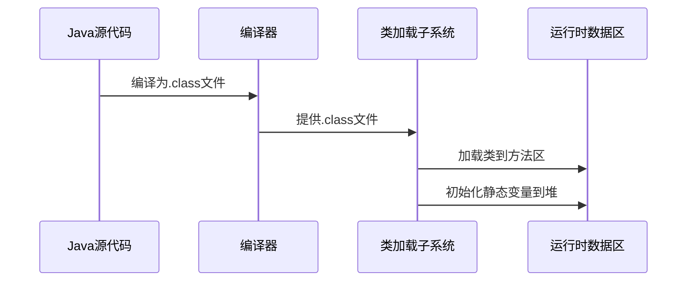
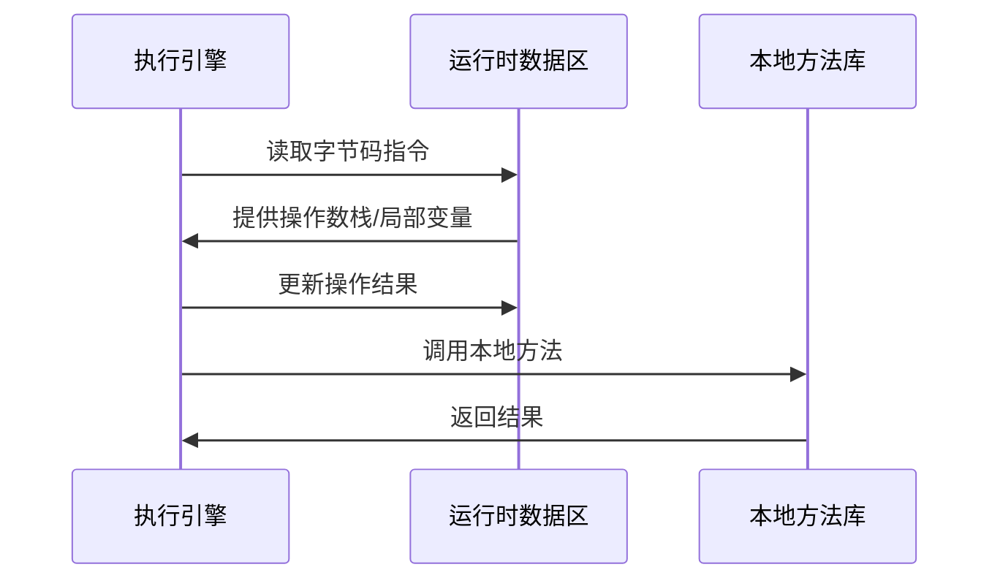
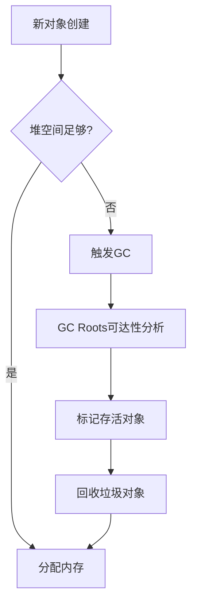
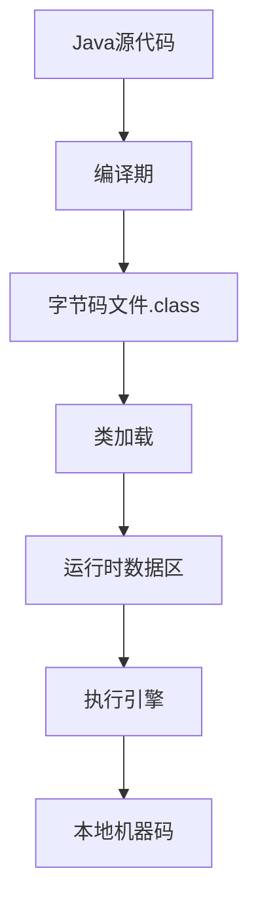

# JVM核心概念及模块协作机制

JVM（Java虚拟机）是Java程序运行的基石，理解其核心概念和各模块的协作方式对于深入掌握Java编程至关重要。下面我将系统性地介绍JVM的核心组成部分及其协作机制。

## 一、JVM核心模块概览

### 1. 类加载子系统（ClassLoader Subsystem）

- 负责加载.class文件
- 进行验证、准备、解析和初始化
- 包含三种类加载器：
  - 启动类加载器（Bootstrap）
  - 扩展类加载器（Extension）
  - 应用类加载器（Application）

### 2. 运行时数据区（Runtime Data Areas）

- 方法区（Method Area）：存储类信息、常量、静态变量
- 堆（Heap）：对象实例存储区域
- 虚拟机栈（VM Stack）：线程私有的方法调用栈
- 本地方法栈（Native Method Stack）：本地方法调用
- 程序计数器（PC Register）：当前线程执行的字节码行号

### 3. 执行引擎（Execution Engine）

- 解释器（Interpreter）：逐行解释字节码
- JIT编译器（Just-In-Time）：热点代码编译为机器码
- 垃圾回收器（GC）：自动内存管理

### 4. 本地方法接口（JNI）

- 提供调用本地方法的能力
- 实现Java与其他语言的交互

## 二、各模块协作流程

### 1. 类加载阶段协作

mermaid

复制



### 2. 程序执行阶段协作

mermaid

复制



### 3. 内存管理协作

mermaid

复制



## 三、核心概念详解

### 1. 类加载机制

**双亲委派模型**：

1. 子加载器先委托父加载器
2. 父加载器无法完成才自己加载
3. 防止核心类被篡改

**加载过程**：

1. 加载：查找并加载字节码
2. 验证：确保格式正确
3. 准备：分配内存并初始化默认值
4. 解析：符号引用转直接引用
5. 初始化：执行方法

### 2. 内存区域交互

**堆与方法区**：

- 方法区存储类信息
- 堆中对象通过方法区信息创建

**虚拟机栈与堆**：

- 栈帧中局部变量表存储基本类型和引用
- 引用指向堆中对象实例

**PC寄存器与执行引擎**：

- PC记录下条指令地址
- 执行引擎根据PC获取指令

### 3. 执行引擎工作

**解释执行**：

- 逐条解释字节码
- 启动速度快但执行慢

**JIT编译**：

- 统计热点代码
- 编译为本地机器码
- 后续直接执行机器码

**混合模式**：

- 默认结合解释器和JIT
- -Xint纯解释模式
- -Xcomp纯编译模式

### 4. GC协作机制

**分代收集**：

- 新生代：复制算法
- 老年代：标记-清除/整理

**跨代引用**：

- 记忆集（Remembered Set）记录跨代引用
- 避免全堆扫描

**GC触发条件**：

- Minor GC：Eden区满
- Major GC：老年代满
- Full GC：方法区满或System.gc()

## 四、关键协作场景

### 1. 对象创建过程

1. 类加载检查
2. 分配内存（指针碰撞/空闲列表）
3. 初始化零值
4. 设置对象头
5. 执行方法

### 2. 方法调用过程

1. 栈帧入栈
2. 局部变量表初始化
3. 操作数栈准备
4. 动态链接解析
5. 方法返回处理

### 3. 异常处理流程

1. 查找异常表
2. 清理操作数栈
3. 恢复调用者栈帧
4. 跳转到异常处理器

## 五、性能优化要点

### 1. 内存分配优化

- 对象优先在Eden区分配
- 大对象直接进老年代
- 长期存活对象年龄阈值设置

### 2. GC调优策略

- 合理设置堆大小（-Xms, -Xmx）
- 新生代比例（-Xmn）
- 选择合适的收集器
- 避免Full GC（合理使用老年代）

### 3. JIT优化建议

- 热点方法尽量短小
- 避免大量反射调用
- 使用final方法
- 循环体内代码优化

## 六、模块协作示例

### 1. 字符串创建过程

java

复制

```java
String s = new String("hello");
```

1. 类加载子系统加载String类
2. 在堆中创建String对象
3. 在常量池创建"hello"（如果不存在）
4. 虚拟机栈存储引用s
5. 执行引擎调用String构造方法

### 2. 方法调用示例

java

复制

```java
public class Test {
    public static void main(String[] args) {
        int result = add(1, 2);
        System.out.println(result);
    }
    
    public static int add(int a, int b) {
        return a + b;
    }
}
```

1. 类加载器加载Test类
2. 执行引擎从main方法开始执行
3. 为add方法创建栈帧
4. 操作数栈存储操作数
5. 执行加法指令
6. 返回结果并弹出栈帧
7. 调用本地方法打印结果

## 七、总结

JVM各模块通过精密的协作实现了Java的"一次编写，到处运行"特性。理解这些核心概念和协作机制，可以帮助开发者：

1. 编写更高效的Java代码
2. 进行精准的JVM调优
3. 快速定位运行时问题
4. 深入理解Java语言特性

JVM的模块化设计和各组件间的协作，体现了计算机科学中"关注点分离"和"职责单一"的设计原则，是值得学习的优秀架构范例。

# Java代码在JVM上的执行全流程详解

Java代码从编写到最终在JVM上执行，经历了一个复杂的转换和执行过程。下面我将详细解析这一完整流程，从源代码到机器执行的全链路。

## 一、整体流程概览

mermaid

复制



## 二、编译期：从Java源码到字节码

### 1. 编译过程

Java编译器（javac）将.java文件转换为.class字节码文件：

1. **词法分析**：将源代码分解为token序列
2. **语法分析**：构建抽象语法树（AST）
3. **语义分析**：检查类型、变量声明等
4. **生成字节码**：转换为JVM指令集

### 2. 字节码结构示例

一个简单方法的字节码表示：

java

复制

```java
public int add(int a, int b) {
    return a + b;
}
```

对应字节码：

markdown

复制

```markdown
0: iload_1    // 加载第一个int参数
1: iload_2    // 加载第二个int参数
2: iadd       // 执行加法
3: ireturn    // 返回结果
```

### 3. 字节码文件结构

.class文件包含：

- 魔数（0xCAFEBABE）
- 版本信息
- 常量池
- 访问标志
- 类索引/父类索引/接口索引
- 字段表
- 方法表
- 属性表

## 三、类加载阶段

### 1. 加载（Loading）

JVM通过类加载器查找并加载.class文件：

1. **全限定名查找**：根据类名查找.class文件
2. **二进制读取**：将文件读入内存
3. **创建Class对象**：在堆中生成对应Class实例

### 2. 链接（Linking）

#### 验证（Verification）

- 文件格式验证
- 元数据验证
- 字节码验证
- 符号引用验证

#### 准备（Preparation）

- 为静态变量分配内存
- 设置默认初始值（0/null/false）

#### 解析（Resolution）

- 将符号引用转换为直接引用
- 涉及类、字段和方法的解析

### 3. 初始化（Initialization）

- 执行`<clinit>`方法（静态变量赋值和静态块）
- 线程安全保证（加锁同步）

## 四、运行时数据区

JVM内存划分为多个区域：

### 1. 程序计数器（PC Register）

- 线程私有
- 记录当前线程执行的字节码行号

### 2. 虚拟机栈（VM Stack）

- 线程私有
- 由栈帧（Frame）组成，每个方法调用创建一个栈帧
- 栈帧包含：
  - 局部变量表（Local Variables）
  - 操作数栈（Operand Stack）
  - 动态链接（Dynamic Linking）
  - 方法返回地址

### 3. 堆（Heap）

- 所有线程共享
- 存储所有对象实例和数组
- GC主要工作区域
- 可分为新生代（Eden+Survivor）和老年代

### 4. 方法区（Method Area）

- 存储类信息、常量、静态变量等
- Java 8后由元空间（Metaspace）实现

### 5. 本地方法栈（Native Method Stack）

- 为本地（Native）方法服务

## 五、执行引擎

### 1. 解释执行

- 逐条读取并解释字节码
- 优点：快速启动
- 缺点：执行效率低

### 2. JIT编译（Just-In-Time）

- 将热点代码编译为本地机器码
- 优化技术：
  - 方法内联
  - 逃逸分析
  - 公共子表达式消除
  - 循环展开

### 3. 混合模式

- 默认结合解释器和JIT
- 参数控制：
  - `-Xint`：纯解释模式
  - `-Xcomp`：纯编译模式

## 六、方法调用过程详解

以以下代码为例：

java

复制

```java
public class Calculator {
    public int add(int a, int b) {
        return a + b;
    }
    
    public static void main(String[] args) {
        Calculator calc = new Calculator();
        int result = calc.add(5, 3);
        System.out.println(result);
    }
}
```

### 1. main方法执行

1. 创建栈帧压入虚拟机栈
2. 局部变量表：
   - args：参数引用
   - calc：Calculator对象引用
   - result：基本类型int

### 2. 对象创建

1. 检查类是否加载
2. 在堆中分配内存（指针碰撞/空闲列表）
3. 初始化对象头（Mark Word+类型指针）
4. 执行`<init>`构造方法

### 3. add方法调用

1. 创建新栈帧
2. 操作数栈操作：
   - iload_1：加载第一个参数
   - iload_2：加载第二个参数
   - iadd：执行加法
   - ireturn：返回结果
3. 栈帧弹出

## 七、内存访问示例

对象内存布局：

markdown

复制

```markdown
+-------------------+
|     对象头        |
|  (Mark Word)      |
|  (类型指针)       |
+-------------------+
|   实例数据        |
|  (字段值)         |
+-------------------+
|   对齐填充        |
|  (可选)           |
+-------------------+
```

数组对象额外包含数组长度信息。

## 八、异常处理机制

### 1. 异常表结构

每个方法对应一个异常表，包含：

- 起始PC
- 结束PC
- 处理PC
- 捕获类型

### 2. 处理流程

1. 查找匹配的异常处理器
2. 清除操作数栈
3. 将异常对象压入栈
4. 跳转到处理代码

## 九、JVM优化技术

### 1. 逃逸分析

- 分析对象作用域
- 可能优化为栈上分配
- 或消除同步操作

### 2. 内联缓存

- 优化虚方法调用
- 基于接收者类型缓存

### 3. 分层编译

- 结合解释和不同级别的编译
- 逐步优化热点代码

## 十、完整执行示例

### 代码：

java

复制

```java
public class Demo {
    private static int count = 0;
    
    public static void main(String[] args) {
        for (int i = 0; i < 10; i++) {
            increment();
        }
        System.out.println("Final count: " + count);
    }
    
    public static void increment() {
        count++;
    }
}
```

### 执行流程：

1. 类加载
   - 加载Demo.class
   - 初始化静态变量count=0
2. main方法执行
   - 创建栈帧
   - 初始化循环变量i=0
3. increment调用
   - getstatic获取count
   - iconst_1加载常量1
   - iadd执行加法
   - putstatic存储结果
4. 循环重复
   - 直到i=10退出
5. 打印输出
   - 创建StringBuilder
   - 拼接字符串
   - 调用PrintStream.println

## 十一、性能考虑

### 1. 类加载优化

- 使用类预加载
- 避免过多小类
- 合理使用自定义加载器

### 2. 内存访问优化

- 对象字段排列（减少缓存行填充）
- 使用基本类型替代包装类
- 避免内存泄漏

### 3. 执行优化

- 热点方法保持短小
- 减少同步块范围
- 利用JIT优化

## 十二、最新发展

### 1. GraalVM

- 支持多语言
- 提前编译（AOT）
- 改进的JIT编译器

### 2. Valhalla项目

- 值类型
- 改进泛型支持

### 3. Loom项目

- 虚拟线程
- 轻量级并发

## 总结

Java代码在JVM上的执行是一个复杂但高度优化的过程：

1. **编译转换**：将高级语言转换为平台无关字节码
2. **类加载**：动态加载和链接类文件
3. **内存管理**：高效组织运行时数据
4. **执行优化**：结合解释和编译执行
5. **持续演进**：适应现代计算需求

理解这一完整流程对于编写高性能Java应用和诊断运行时问题至关重要。JVM的架构设计平衡了可移植性、安全性和性能，是Java生态持续繁荣的基石。