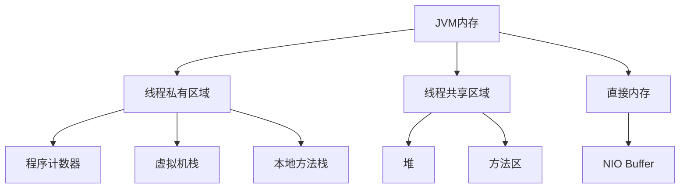

# JVM内存模型详解

Java虚拟机(JVM)内存模型是理解Java程序运行机制的核心基础。下面我将从内存区域划分、各区域功能、内存管理机制等方面进行全面解析。

## 一、JVM内存区域总体划分

mermaid

复制



## 二、线程私有内存区域

### 1. 程序计数器(Program Counter Register)

**特性**：

- 线程私有，生命周期与线程相同
- 占用较小内存空间
- 无OOM(OutOfMemoryError)风险

**功能**：

- 记录当前线程执行的字节码指令地址
- 执行Native方法时值为undefined

**示例**：

markdown

复制

```markdown
线程1 PC -> 行号5: aload_0
线程2 PC -> 行号12: invokevirtual
```

### 2. Java虚拟机栈(Java Virtual Machine Stacks)

**栈帧结构**：

markdown

复制

```markdown
+-------------------+
| 局部变量表        |
| (Local Variables) |
+-------------------+
| 操作数栈          |
| (Operand Stack)   |
+-------------------+
| 动态链接          |
| (Dynamic Linking) |
+-------------------+
| 方法返回地址       |
| (Return Address)  |
+-------------------+
```

**异常**：

- StackOverflowError：栈深度超过限制(-Xss参数设置)
- OutOfMemoryError：栈扩展失败

**局部变量表**：

- 以Slot为最小单位
- 基本类型占用1个Slot(long/double占2个)
- 引用类型存储指向堆的指针

### 3. 本地方法栈(Native Method Stack)

**特点**：

- 为Native方法服务
- HotSpot将虚拟机栈和本地方法栈合二为一
- 同样会抛出StackOverflowError和OOM

## 三、线程共享内存区域

### 1. Java堆(Java Heap)

**存储内容**：

- 对象实例
- 数组
- 字符串常量池(Java 7+)

**关键参数**：

- -Xms：初始堆大小
- -Xmx：最大堆大小
- -Xmn：新生代大小
- -XX:NewRatio：新生代/老年代比例

**分代结构**：

markdown

复制

```markdown
+-----------------------+
|       堆内存          |
| +-------------------+ |
| |    新生代         | |
| | +-----+ +-------+ | |
| | |Eden | |Survivor| | |
| | |(80%)| |(From/To)| | |
| | +-----+ +-------+ | |
| |       (20%)       | |
| +-------------------+ |
|                       |
| +-------------------+ |
| |    老年代         | |
| |                   | |
| +-------------------+ |
+-----------------------+
```

### 2. 方法区(Method Area)

**演进历史**：

- ≤Java7：永久代(PermGen)，大小由-XX:MaxPermSize指定
- ≥Java8：元空间(Metaspace)，使用本地内存

**存储内容**：

- 类型信息
- 运行时常量池
- 字段和方法信息
- 方法字节码
- JIT编译代码

**参数控制**：

- -XX:MetaspaceSize：初始大小
- -XX:MaxMetaspaceSize：最大大小

## 四、直接内存(Direct Memory)

**特点**：

- 不是JVM运行时数据区的一部分
- 通过NIO的ByteBuffer.allocateDirect分配
- 大小受-XX:MaxDirectMemorySize限制

**优势**：

- 减少堆内外数据拷贝
- 提高IO性能

## 五、内存模型详解

### 1. 对象内存布局

普通对象：

markdown

复制

```markdown
+-----------------------+
|      对象头(Mark Word)| 8字节
+-----------------------+
| 类型指针(Class Pointer)| 4/8字节
+-----------------------+
|      实例数据         | 
| (包括父类继承字段)     |
+-----------------------+
|      对齐填充         | (可选)
+-----------------------+
```

数组对象额外包含：

markdown

复制

```markdown
+-----------------------+
|      数组长度         | 4字节
+-----------------------+
```

### 2. Mark Word结构

32位虚拟机：

markdown

复制

```markdown
+--------+--------+--------+--------+
|  锁状态   |    GC信息   |  哈希码   |
+--------+--------+--------+--------+
```

64位虚拟机：

markdown

复制

```markdown
+-------------------------------+-------------------------------+
|                  Mark Word (64位)                             |
|                                                               |
| 锁状态 | 分代年龄 | 是否偏向锁 | 锁标志位 | 其他信息            |
+-------------------------------+-------------------------------+
```

### 3. 指针压缩优化(-XX:+UseCompressedOops)

**效果**：

- 将64位指针压缩为32位
- 节省内存(特别是大量小对象时)

**限制**：

- 堆内存≤32GB时有效
- 不压缩的对象：
  - 指向非堆的对象指针
  - 本地变量/堆栈元素/异常处理程序等

## 六、内存访问机制

### 1. 对象访问方式

**句柄访问**：

markdown

复制

```markdown
+-------------------+       +-------------------+       +-------------------+
|   局部变量表      | ----> |     句柄池        | ----> |   对象实例数据    |
| (reference)       |       | (间接指针)        |       | (堆内存)         |
+-------------------+       +-------------------+       +-------------------+
                                         |
                                         v
                                +-------------------+
                                |   对象类型数据     |
                                | (方法区)          |
                                +-------------------+
```

**直接指针访问(HotSpot实现)**：

markdown

复制

```markdown
+-------------------+       +-------------------+       +-------------------+
|   局部变量表      | ----> |   对象实例数据    | ----> |   对象类型数据    |
| (reference)       |       | (包含类型指针)    |       | (方法区)         |
+-------------------+       +-------------------+       +-------------------+
```

### 2. 内存屏障(Memory Barrier)

**类型**：

- LoadLoad屏障
- StoreStore屏障
- LoadStore屏障
- StoreLoad屏障

**作用**：

- 保证多线程下的内存可见性
- 防止指令重排序

## 七、内存异常分析

### 1. 堆内存溢出

**特征**：

- java.lang.OutOfMemoryError: Java heap space
- 堆内存统计图呈上升趋势直至崩溃

**解决方案**：

- 检查内存泄漏
- 增加-Xmx值
- 优化对象生命周期

### 2. 栈溢出

**特征**：

- java.lang.StackOverflowError
- 常见于深度递归调用

**解决方案**：

- 优化递归为循环
- 增加-Xss栈大小
- 检查无限递归

### 3. 元空间溢出

**特征**：

- java.lang.OutOfMemoryError: Metaspace
- 类加载数量异常增长

**解决方案**：

- 增加-XX:MaxMetaspaceSize
- 检查动态类生成
- 优化类加载器使用

## 八、内存管理最佳实践

### 1. 对象分配优化

- 避免创建过多短命对象
- 合理初始化集合大小
- 使用对象池技术

### 2. 内存监控工具

- jstat：监控内存使用统计
- jmap：生成堆转储快照
- VisualVM：可视化内存分析
- Eclipse MAT：内存分析工具

### 3. 参数调优建议

bash

复制

```bash
# 生产环境推荐配置
-Xms4g -Xmx4g           # 初始堆=最大堆，避免动态调整
-XX:MetaspaceSize=256m  # 元空间初始大小
-XX:MaxMetaspaceSize=512m
-Xmn2g                  # 新生代大小(推荐1/3~1/2总堆)
-XX:SurvivorRatio=8     # Eden与Survivor比例
```

## 九、JMM与硬件内存模型

### 1. Java内存模型(JMM)特性

- 原子性：synchronized/lock保证
- 可见性：volatile/final/synchronized保证
- 有序性：happens-before原则

### 2. 与硬件内存关系

多核CPU架构下的内存访问：

markdown

复制

```markdown
+---------------+       +---------------+       +---------------+
|   CPU Core1   | <---> |   CPU缓存L1   | <---> |   内存总线     |
+---------------+       +---------------+       +---------------+
       ^                      ^                      ^
       |                      |                      |
+---------------+       +---------------+       +---------------+
|   CPU Core2   | <---> |   CPU缓存L2   | <---> |   主内存       |
+---------------+       +---------------+       +---------------+
```

JMM通过内存屏障解决缓存一致性问题。

## 十、总结

JVM内存模型的核心要点：

1. **分区明确**：线程私有与共享区域严格隔离
2. **对象生命周期**：从创建到回收的全过程管理
3. **高效访问**：通过指针压缩、内存屏障等优化
4. **异常防护**：多种OOM类型及应对策略
5. **持续演进**：从永久代到元空间的改进

理解JVM内存模型对于编写高性能、高可靠性的Java应用至关重要，也是进行JVM调优和故障诊断的基础。