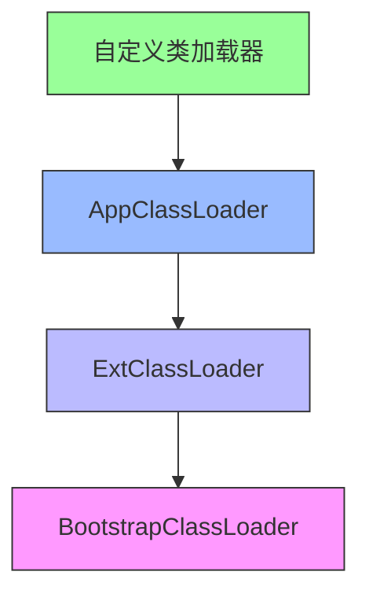

# 双亲委派机制与类加载器详解

## 一、双亲委派机制的核心目的

双亲委派模型(Parent Delegation Model)是Java类加载器的工作机制，主要解决以下关键问题：

1. **安全性保障**：
   - 防止核心Java类库被篡改（如有人自定义`java.lang.Object`）
   - 确保基础类的行为一致性
2. **避免重复加载**：
   - 保证类只被加载一次，防止内存中出现多个相同类
3. **层次化管理**：
   - 明确类加载的责任边界
   - 形成清晰的类查找路径

## 二、双亲委派工作流程

mermaid

复制



**加载顺序**：

1. 收到加载请求后，先委托父加载器尝试加载
2. 父加载器再委托它的父加载器
3. 直到Bootstrap ClassLoader
4. 如果所有父加载器都无法完成，才由自己加载

**代码体现**：

java

复制

```java
protected Class<?> loadClass(String name, boolean resolve) {
    synchronized (getClassLoadingLock(name)) {
        // 1. 检查是否已加载
        Class<?> c = findLoadedClass(name);
        if (c == null) {
            try {
                // 2. 委托父加载器
                if (parent != null) {
                    c = parent.loadClass(name, false);
                } else {
                    // 3. 到达Bootstrap
                    c = findBootstrapClassOrNull(name);
                }
            } catch (ClassNotFoundException e) {}
            
            if (c == null) {
                // 4. 自己尝试加载
                c = findClass(name);
            }
        }
        return c;
    }
}
```

## 三、三大类加载器及其加载范围

### 1. 启动类加载器(Bootstrap ClassLoader)

**特点**：

- 由C++实现，是JVM的一部分
- 没有Java层面的对应类(null)
- 父加载器为null（处于委派链顶端）

**加载范围**：

markdown

复制

```markdown
$JAVA_HOME/jre/lib/
    - rt.jar (核心类如java.lang.*)
    - charsets.jar
    - jce.jar
    - jsse.jar
    - 其他重要资源
```

**验证代码**：

java

复制

```java
System.out.println(String.class.getClassLoader());  // 输出null
System.out.println(Object.class.getClassLoader()); // 输出null
```

### 2. 扩展类加载器(Extension ClassLoader)

**特点**：

- sun.misc.Launcher$ExtClassLoader（Java实现）
- 父加载器是Bootstrap
- 可从Java代码获取引用

**加载范围**：

markdown

复制

```markdown
$JAVA_HOME/jre/lib/ext/
    - 所有.jar文件
或由java.ext.dirs系统变量指定的目录
```

**验证代码**：

java

复制

```java
ClassLoader extLoader = ClassLoader.getSystemClassLoader().getParent();
System.out.println(extLoader);  // sun.misc.Launcher$ExtClassLoader@xxxx

// 查看加载路径
String extDirs = System.getProperty("java.ext.dirs");
System.out.println(extDirs);
```

### 3. 应用程序类加载器(Application ClassLoader)

**特点**：

- sun.misc.Launcher$AppClassLoader（Java实现）
- 父加载器是Extension
- 也称为"系统类加载器"

**加载范围**：

markdown

复制

```markdown
-classpath或-cp参数指定的路径
环境变量CLASSPATH指定的路径
默认当前目录(.)
```

**验证代码**：

java

复制

```java
ClassLoader appLoader = ClassLoader.getSystemClassLoader();
System.out.println(appLoader);  // sun.misc.Launcher$AppClassLoader@xxxx

// 查看加载路径
String classpath = System.getProperty("java.class.path");
System.out.println(classpath);
```

## 四、JAR包的加载机制

### 1. JAR包作为类路径资源

**加载方式**：

- JAR包本质上是一个zip格式的类容器
- 所有标准类加载器都可以加载JAR中的类
- 加载逻辑与普通.class文件相同

**示例场景**：

bash

复制

```bash
# 通过-classpath指定jar
java -cp lib/myapp.jar;lib/dependency.jar com.example.Main

# 通过环境变量
export CLASSPATH=lib/myapp.jar:lib/dependency.jar
java com.example.Main
```

### 2. 不同加载器加载JAR的差异

| 加载器类型  | JAR加载位置              | 典型示例       |
| ----------- | ------------------------ | -------------- |
| Bootstrap   | $JAVA_HOME/lib/*.jar     | rt.jar         |
| Extension   | $JAVA_HOME/lib/ext/*.jar | localedata.jar |
| Application | classpath指定的.jar      | myapp.jar      |

### 3. 自定义JAR加载

通过URLClassLoader动态加载：

java

复制

```java
// 创建自定义加载器加载jar
URL[] urls = { new URL("file:lib/mylib.jar") };
URLClassLoader loader = new URLClassLoader(urls);

// 加载jar中的类
Class<?> clazz = loader.loadClass("com.example.MyClass");
```

## 四、打破双亲委派的场景

### 1. 典型场景

1. **JNDI服务**：
   - 需要加载厂商实现的SPI接口
   - 使用线程上下文类加载器(Thread Context ClassLoader)
2. **OSGi框架**：
   - 每个Bundle有自己的类加载器
   - 网状委派结构替代双亲委派
3. **热部署**：
   - 需要重新加载修改后的类
   - 创建新的类加载器实例

### 2. 代码示例（打破双亲委派）

java

复制

```java
public class CustomClassLoader extends ClassLoader {
    @Override
    protected Class<?> loadClass(String name, boolean resolve) 
        throws ClassNotFoundException {
        // 1. 先检查自定义路径
        try {
            Class<?> c = findClass(name);
            if (c != null) return c;
        } catch (ClassNotFoundException e) {}
        
        // 2. 再走默认双亲委派
        return super.loadClass(name, resolve);
    }
    
    @Override
    protected Class<?> findClass(String name) {
        // 自定义加载逻辑
        byte[] bytes = loadClassData(name);
        return defineClass(name, bytes, 0, bytes.length);
    }
}
```

## 五、类加载器与JAR加载常见问题

### Q1：NoClassDefFoundError与ClassNotFoundException区别？

|              | ClassNotFoundException | NoClassDefFoundError      |
| ------------ | ---------------------- | ------------------------- |
| **触发时机** | 类加载时               | 类已加载但初始化失败      |
| **常见原因** | 类路径缺失             | 静态初始化失败/版本不兼容 |
| **检查方式** | 检查classpath          | 检查静态代码块和依赖      |

### Q2：如何排查类加载冲突？

1. 使用`-verbose:class`参数查看加载过程

2. 通过`Class.getClassLoader()`确认加载来源

3. 使用工具分析：

   bash

   复制

   ```bash
   jcmd <pid> VM.classloader_stats
   ```

### Q3：如何实现热更新的JAR加载？

java

复制

```java
// 每次创建新的ClassLoader实例
URL[] urls = { new URL("file:updated.jar") };
URLClassLoader newLoader = new URLClassLoader(urls, null);

// 通过反射创建新实例
Class<?> reloadedClass = newLoader.loadClass("com.example.HotClass");
Object newInstance = reloadedClass.newInstance();
```

## 六、总结

1. **双亲委派机制**：
   - 保障安全性的核心设计
   - 形成层次化类查找路径
2. **三大加载器分工**：
   - Bootstrap：加载核心Java类
   - Extension：加载扩展类
   - Application：加载应用类
3. **JAR加载能力**：
   - 所有标准加载器都支持JAR加载
   - 可通过URLClassLoader动态加载
4. **高级场景**：
   - 理解打破双亲委派的合理场景
   - 掌握自定义加载器的实现方法

理解这些机制对于实现模块化设计、热部署等高级功能至关重要，也是诊断类加载相关问题的关键基础。