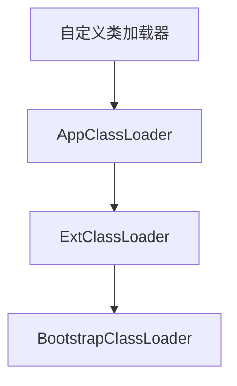
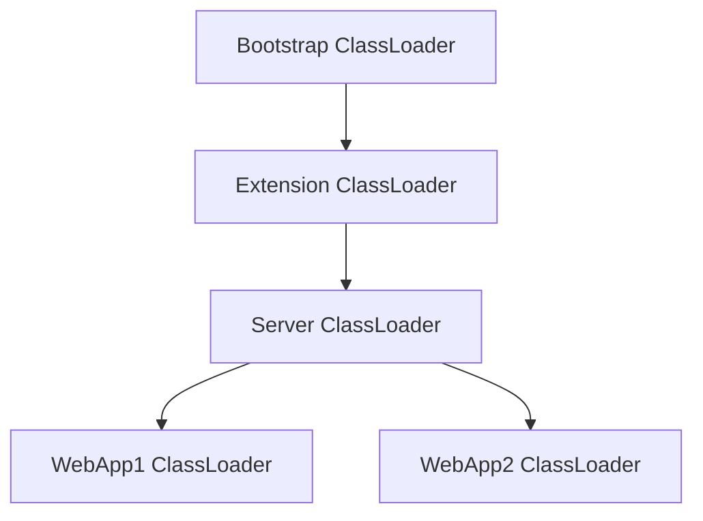
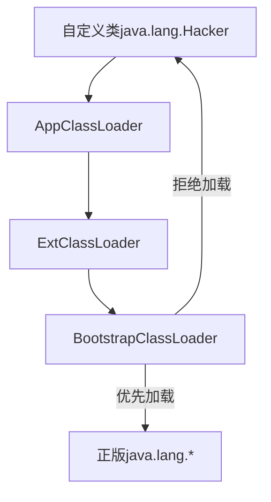
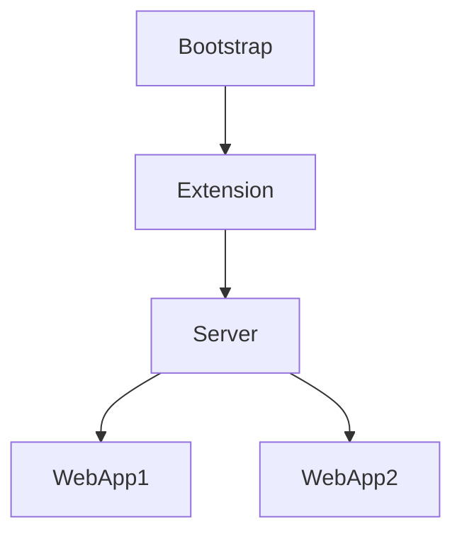

# JVM类加载器详解

类加载器(ClassLoader)是Java虚拟机(JVM)的核心组件之一，负责将Java类文件(.class)加载到JVM中，并转换为可以被JVM执行的运行时数据结构。下面我将从多个维度详细讲解类加载器的作用、类型和工作原理。

## 一、类加载器的核心职责

类加载器主要完成以下工作：

1. **加载(Loading)**：
   - 查找并读取.class文件的二进制数据
   - 将字节流转换为方法区中的运行时数据结构
   - 在堆中创建对应的java.lang.Class对象
2. **验证(Verification)**：
   - 文件格式验证（魔数检查）
   - 元数据验证（语义分析）
   - 字节码验证（栈映射帧）
   - 符号引用验证
3. **准备(Preparation)**：
   - 为类变量(static变量)分配内存
   - 设置默认初始值（0/null/false等）
4. **解析(Resolution)**：
   - 将符号引用转换为直接引用
   - 涉及类、字段、方法的解析
5. **初始化(Initialization)**：
   - 执行类构造器()方法
   - 真正为静态变量赋值
   - 执行静态代码块

## 二、类加载器的类型与层次结构

JVM中有三类主要的类加载器，形成严格的层次结构：

### 1. 启动类加载器(Bootstrap ClassLoader)

- **层级**：最顶层
- **实现**：由C++实现，是JVM自身的一部分
- 职责：
  - 加载JAVA_HOME/lib目录下的核心类库
  - 如rt.jar、charsets.jar等
- 特点：
  - 唯一没有父类的加载器
  - 无法被Java程序直接引用

### 2. 扩展类加载器(Extension ClassLoader)

- **层级**：第二层
- **实现**：sun.misc.Launcher$ExtClassLoader
- 职责：
  - 加载JAVA_HOME/lib/ext目录下的扩展类
  - 或java.ext.dirs系统变量指定的路径
- 特点：
  - 父加载器是Bootstrap
  - 可以被Java程序获取和操作

### 3. 应用程序类加载器(Application ClassLoader)

- **层级**：第三层
- **实现**：sun.misc.Launcher$AppClassLoader
- 职责：
  - 加载用户类路径(classpath)上的类
  - 即开发者自己编写的类
- 特点：
  - 父加载器是Extension
  - 也称为"系统类加载器"

### 4. 自定义类加载器

开发者可以继承ClassLoader类，实现自己的类加载器：

java

复制

```java
public class MyClassLoader extends ClassLoader {
    @Override
    protected Class<?> findClass(String name) {
        // 自定义加载逻辑
    }
}
```

## 三、双亲委派模型

### 1. 工作原理

当类加载器收到加载请求时：

1. 先委托父加载器尝试加载
2. 父加载器再委托它的父加载器
3. 直到Bootstrap ClassLoader
4. 如果所有父加载器都无法完成，才由自己加载

mermaid

复制



### 2. 代码实现

查看ClassLoader的loadClass方法：

java

复制

```java
protected Class<?> loadClass(String name, boolean resolve) {
    synchronized (getClassLoadingLock(name)) {
        // 1. 检查是否已加载
        Class<?> c = findLoadedClass(name);
        if (c == null) {
            try {
                // 2. 委托父加载器
                if (parent != null) {
                    c = parent.loadClass(name, false);
                } else {
                    // 3. 到达Bootstrap
                    c = findBootstrapClassOrNull(name);
                }
            } catch (ClassNotFoundException e) {}
            
            if (c == null) {
                // 4. 自己尝试加载
                c = findClass(name);
            }
        }
        return c;
    }
}
```

### 3. 设计优势

1. **安全性**：防止核心类被篡改
2. **避免重复加载**：保证类只被加载一次
3. **结构清晰**：明确的层次关系

## 四、类加载器的实际应用场景

### 1. 热部署实现

通过自定义类加载器实现代码热更新：

java

复制

```java
public class HotDeployClassLoader extends URLClassLoader {
    public HotDeployClassLoader(URL[] urls) {
        super(urls);
    }
    
    @Override
    protected Class<?> loadClass(String name, boolean resolve) {
        // 打破双亲委派，先自己加载
        try {
            return findClass(name);
        } catch (ClassNotFoundException e) {
            return super.loadClass(name, resolve);
        }
    }
}
```

### 2. 模块化隔离

实现不同模块的类隔离：

java

复制

```java
ClassLoader module1Loader = new URLClassLoader(new URL[]{module1Jar});
ClassLoader module2Loader = new URLClassLoader(new URL[]{module2Jar});

Class<?> class1 = module1Loader.loadClass("com.module1.Foo");
Class<?> class2 = module2Loader.loadClass("com.module2.Foo");

// 来自不同加载器的相同类名不相等
assert class1 != class2; 
```

### 3. 加密类保护

加载加密的class文件：

java

复制

```java
public class SecureClassLoader extends ClassLoader {
    @Override
    protected Class<?> findClass(String name) {
        byte[] encrypted = loadEncryptedClassData(name);
        byte[] decrypted = decrypt(encrypted); // 解密逻辑
        return defineClass(name, decrypted, 0, decrypted.length);
    }
}
```

## 五、类加载器常见问题

### 1. ClassCastException异常

原因：相同类被不同加载器加载

java

复制

```java
// 假设obj1和obj2是同一个类但来自不同加载器
MyInterface obj1 = (MyInterface)loader1.loadClass("Foo").newInstance();
MyInterface obj2 = (MyInterface)loader2.loadClass("Foo").newInstance();

// 抛出ClassCastException
obj1.doSomething(obj2); 
```

### 2. NoClassDefFoundError

可能原因：

- 类文件存在但格式错误
- 类初始化失败
- 类加载器无法找到依赖类

### 3. LinkageError

典型场景：

- 不同加载器加载了不兼容的类版本
- 违反了类加载约束

## 六、类加载器性能优化

1. **缓存已加载类**：
   - ClassLoader内部维护已加载类的缓存
   - 避免重复加载开销
2. **并行加载**：
   - JDK9引入并行类加载能力
   - 使用`-XX:+ClassParallelLoad`启用
3. **类共享**：
   - AppCDS(Application Class-Data Sharing)
   - 将已加载类信息转储为共享存档
4. **减少自定义加载器**：
   - 每个新加载器都有内存开销
   - 合理复用现有加载器

## 七、最新发展

### 1. 模块化系统(Java 9+)

- 引入模块路径替代类路径

- 新的类加载机制：

  java

  复制

  ```java
  ModuleLayer layer = ModuleLayer.boot();
  Class<?> c = layer.findLoader("module.name").loadClass("pkg.Class");
  ```

### 2. Jigsaw与类加载器

- 每个模块有专属的类加载器
- 更精细的可见性控制
- 替代原有的扩展机制

## 总结

JVM类加载器是Java动态性的基石，它：

1. 通过层次化设计保障安全
2. 通过双亲委派保证一致性
3. 通过灵活扩展支持各种高级特性

理解类加载机制对于实现热部署、模块隔离、代码加密等高级功能至关重要，也是诊断类加载相关问题的关键。随着Java平台的发展，类加载器仍在不断演进，但其核心思想始终保持不变。

# 类加载器的必要性与工作时机

类加载器(ClassLoader)是Java虚拟机(JVM)的核心组件之一，它在Java程序的整个生命周期中扮演着至关重要的角色。下面我将详细解析为什么需要类加载器以及它在何时工作。

## 一、为什么需要类加载器？

### 1. 实现"一次编写，到处运行"的基石

Java的核心优势之一是平台无关性，类加载器通过以下方式实现这一目标：

- **字节码统一加载**：无论.class文件来自何处（本地、网络、内存等），都由类加载器统一加载
- **运行时动态加载**：允许在程序运行时按需加载类，而非一次性加载所有类
- **安全隔离**：防止恶意代码污染核心类库

### 2. 解决的关键问题

| 问题     | 类加载器解决方案                                |
| -------- | ----------------------------------------------- |
| 代码组织 | 分层加载机制（Bootstrap→Extension→Application） |
| 版本冲突 | 双亲委派模型避免核心类被覆盖                    |
| 代码安全 | 沙箱机制保护核心类库                            |
| 动态扩展 | 支持热部署和模块化加载                          |
| 资源隔离 | 不同加载器加载的类视为不同类                    |

### 3. 技术必要性

- **内存管理**：按需加载减少内存占用
- **灵活性**：支持从多种来源加载类（JAR、网络、动态生成等）
- **多版本共存**：通过不同加载器实现类隔离

## 二、类加载器的工作时机

类加载器在Java程序运行的多个阶段发挥作用：

### 1. 程序启动阶段

- **初始加载**：

  - 加载`public static void main(String[])`所在类

  - 加载main方法直接依赖的所有类

  - 示例：

    java

    复制

    ```java
    public class Main {
        public static void main(String[] args) {
            // 启动时加载Main类及其直接依赖
            Helper.doSomething();
        }
    }
    ```

- **核心类库加载**：

  - Bootstrap加载器加载java.lang等核心包
  - 大约1000+个核心类在JVM启动时加载

### 2. 运行时动态加载

- **首次使用触发**：

  java

  复制

  ```java
  public class DynamicLoad {
      void process() {
          // 当执行到此处时才加载SomeClass
          SomeClass obj = new SomeClass();
      }
  }
  ```

- **反射加载**：

  java

  复制

  ```java
  // 运行时动态加载
  Class<?> clazz = Class.forName("com.example.DynamicClass");
  ```

- **JSP/Servlet容器**：

  - Web应用中的类在请求到达时加载
  - 每个Web应用有独立的类加载器

### 3. 特殊场景加载

- **动态代理**：

  java

  复制

  ```java
  Proxy.newProxyInstance(
      target.getClass().getClassLoader(),
      target.getClass().getInterfaces(),
      handler);
  ```

- **OSGi/模块化系统**：

  - 每个Bundle有独立的类加载器
  - 实现精细化的类可见性控制

- **热部署**：

  java

  复制

  ```java
  // 自定义类加载器实现热部署
  MyClassLoader loader = new MyClassLoader();
  Class<?> reloadedClass = loader.loadClass("HotClass");
  ```

## 三、类加载器的具体工作流程

### 1. 加载阶段

1. **查找二进制流**：
   - 从文件系统（.class文件）
   - 从JAR/ZIP包
   - 从网络（Applet）
   - 动态生成（Proxy/JSP）
2. **转换为方法区数据结构**：
   - 在方法区创建类对应的运行时数据结构
   - 在堆中创建Class对象（作为方法区数据的访问入口）

### 2. 验证阶段

- **文件格式验证**：检查魔数0xCAFEBABE
- **元数据验证**：检查语义合法性
- **字节码验证**：通过数据流分析确保合规
- **符号引用验证**：确保后续解析能正常执行

### 3. 准备阶段

- 为**类变量**（static变量）分配内存

- 设置**默认初始值**（0、false、null等）

- 注意：此时不执行任何Java代码

  java

  复制

  ```java
  public static int value = 123; 
  // 准备阶段value=0，初始化阶段才变为123
  ```

### 4. 解析阶段

将符号引用转换为直接引用：

- **类/接口解析**
- **字段解析**
- **方法解析**
- **接口方法解析**

### 5. 初始化阶段

- 执行类构造器`<clinit>()`方法

- 按顺序执行：

  - 静态变量赋值
  - 静态代码块

  java

  复制

  ```java
  public class InitDemo {
      static {
          System.out.println("静态块执行");
      }
      public static int value = 123;
  }
  ```

## 四、类加载器的实际应用场景

### 1. Web服务器中的隔离

mermaid

复制



- 每个Web应用使用独立类加载器
- 实现应用间类隔离

### 2. Android中的Dex加载

java

复制

```java
// Android独特的类加载机制
PathClassLoader pathClassLoader = new PathClassLoader(
    apkPath, libraryPath, parentLoader);
```

### 3. 热部署实现

java

复制

```java
while (true) {
    // 每次创建新的类加载器
    HotSwapClassLoader loader = new HotSwapClassLoader();
    Class<?> cls = loader.loadClass("MyHotClass");
    Object instance = cls.newInstance();
    // 执行业务逻辑...
    Thread.sleep(5000); // 等待类文件修改
}
```

## 五、常见问题与解决方案

### 1. ClassNotFoundException

**原因**：

- 类路径配置错误
- 依赖缺失
- 类加载器委托链断裂

**解决**：

java

复制

```java
// 检查当前类加载器
Thread.currentThread().getContextClassLoader();

// 确保资源在classpath中
URLClassLoader loader = new URLClassLoader(new URL[]{
    new File("lib/mylib.jar").toURI().toURL()
});
```

### 2. NoClassDefFoundError

**原因**：

- 类加载成功但初始化失败
- 静态初始化块抛出异常
- 版本不兼容

**排查**：

1. 检查静态初始化代码
2. 验证依赖版本
3. 查看类加载日志

### 3. LinkageError

**场景**：

- 不同加载器加载了不兼容的类版本
- 违反了类加载约束

**预防**：

- 遵循双亲委派原则
- 避免重复加载相同类

## 六、性能优化建议

1. **减少类加载量**：

   - 合并小类
   - 使用jar索引

2. **并行加载**：

   bash

   复制

   ```bash
   -XX:+ClassParallelLoad  # JDK9+
   ```

3. **类共享**：

   bash

   复制

   ```bash
   -Xshare:on  # 启用CDS
   ```

4. **缓存策略**：

   - 合理使用Class.forName缓存
   - 避免频繁创建类加载器

## 总结

类加载器是Java动态性的核心支撑：

- **必要性**：实现安全隔离、动态加载、内存管理等关键功能
- **工作时机**：贯穿程序启动、运行和特殊需求的各个阶段
- **最佳实践**：理解双亲委派、掌握调试技巧、合理优化性能

理解类加载机制，才能真正掌握Java程序的运行本质，也是实现高级特性（如热部署、模块化等）的基础。随着模块化系统（JPMS）等新技术的发展，类加载器仍在持续演进，但其核心价值始终不变。

# 双亲委派机制的安全保障与加载器特性解析

双亲委派模型是Java类加载体系的核心设计，它通过特定的层次结构和委派机制保障了Java运行环境的安全性和稳定性。下面我将详细解析双亲委派如何保证安全，以及Bootstrap加载器与其他加载器的本质区别。

## 一、双亲委派如何保证安全？

### 1. 核心安全机制

#### (1) 防止核心类被篡改

mermaid

复制



- **保护原理**：任何对核心类库（如java.lang包）的加载请求都会最终委派给Bootstrap加载器
- **实际效果**：自定义的"java.lang.Xxx"类无法被加载，避免恶意代码污染核心类库

#### (2) 避免类重复加载

java

复制

```java
// 不同加载器加载的相同类被视为不同类
Class<?> c1 = loader1.loadClass("com.example.Foo");
Class<?> c2 = loader2.loadClass("com.example.Foo");
System.out.println(c1 == c2); // 输出false
```

- **安全意义**：防止类冲突导致的安全漏洞（如中间人攻击）

#### (3) 沙箱隔离

- 应用类无法冒充核心类获取权限
- 不同加载器之间形成天然隔离

### 2. 安全验证流程

双亲委派实际构建了三重安全屏障：

| 层级       | 安全检查点      | 示例威胁拦截     |
| ---------- | --------------- | ---------------- |
| 委派屏障   | 父加载器优先    | 阻止自定义核心类 |
| 字节码验证 | 类文件校验      | 阻止篡改的字节码 |
| 运行时权限 | SecurityManager | 阻止越权操作     |

## 二、Bootstrap加载器的特殊性

### 1. 本质区别

| 特性     | Bootstrap ClassLoader | 自定义/其他加载器       |
| -------- | --------------------- | ----------------------- |
| 实现语言 | C++（JVM内部实现）    | Java（继承ClassLoader） |
| 可见性   | Java中表示为null      | 有具体ClassLoader实例   |
| 加载路径 | JRE/lib目录           | 自定义路径              |
| 加载时机 | JVM启动时初始化       | 运行时动态创建          |
| 覆盖方式 | 需-Xbootclasspath     | 直接指定路径            |

### 2. Bootstrap加载器的不可替代性

**为什么不能像自定义加载器一样实现？**

1. **启动依赖问题**：

   - Bootstrap加载器需要加载ClassLoader类本身
   - 形成"鸡生蛋蛋生鸡"的依赖关系

   mermaid

   复制

   ```mermaid
   graph LR
       A[Bootstrap加载器] --> B[加载java.lang.ClassLoader]
       B --> C[用于创建其他加载器]
   ```

2. **安全信任根**：

   - 作为JVM最底层的加载器
   - 必须与JVM紧密集成才能建立信任链起点

3. **性能考量**：

   - 核心类加载需要最高效率
   - 避免Java层面的性能开销

### 3. 加载器层次验证

通过代码验证不同加载器的特性：

java

复制

```java
public class LoaderHierarchy {
    public static void main(String[] args) {
        // 1. Bootstrap加载的类
        System.out.println("String的加载器: " + 
            String.class.getClassLoader()); // null
        
        // 2. Extension加载的类
        System.out.println("ZipInfo的加载器: " + 
            java.util.zip.ZipInfo.class.getClassLoader()); // null(实际是Bootstrap)
        // 注：JDK8后许多扩展类改由Bootstrap加载
        
        // 3. Application加载的类
        System.out.println("当前类的加载器: " + 
            LoaderHierarchy.class.getClassLoader()); // sun.misc.Launcher$AppClassLoader
        
        // 4. 自定义加载器
        ClassLoader customLoader = new CustomLoader();
        System.out.println("自定义加载器父级: " + customLoader.getParent());
    }
    
    static class CustomLoader extends ClassLoader {
        // 自定义加载逻辑
    }
}
```

## 三、双亲委派的安全漏洞与修复

### 1. 历史安全漏洞

#### (1) JVM TI绕过（CVE-2016-3427）

- **问题**：通过JVMTI可绕过双亲委派
- **修复**：增强安全检查

#### (2) 序列化绕过（CVE-2017-3509）

- **问题**：通过序列化构造恶意类
- **修复**：加强反序列化校验

### 2. 现代安全增强

#### (1) 模块化系统（Java 9+）

java

复制

```java
module my.module {
    requires java.base;
    exports com.my.package;
}
```

- 通过模块描述明确依赖和导出关系
- 替代部分双亲委派的安全职责

#### (2) 类加载器隔离

mermaid

复制



- 每个Web应用使用独立类加载器
- 防止应用间类干扰

## 四、打破双亲委派的合法场景

### 1. 典型合法用例

| 场景        | 实现方式         | 安全措施     |
| ----------- | ---------------- | ------------ |
| SPI服务加载 | 线程上下文加载器 | 接口白名单   |
| OSGi模块化  | 网状委派         | 严格权限控制 |
| 热部署      | 新建加载器       | 版本校验     |
| 代码隔离    | 自定义委派逻辑   | 安全沙箱     |

### 2. 服务加载示例（SPI）

java

复制

```java
// 使用线程上下文加载器打破双亲委派
ClassLoader original = Thread.currentThread().getContextClassLoader();
try {
    Thread.currentThread().setContextClassLoader(customLoader);
    ServiceLoader<MyService> loader = ServiceLoader.load(MyService.class);
    // ...
} finally {
    Thread.currentThread().setContextClassLoader(original);
}
```

## 五、总结：安全设计精要

1. **信任链构建**：

   - Bootstrap作为可信根
   - 自上而下的委派形成信任传递

2. **不可篡改性**：

   - 核心类库由JVM控制
   - 无法通过常规方式替换

3. **层次化防护**：

   mermaid

   复制

   ```mermaid
   graph LR
       A[开发者代码] --> B[应用加载器]
       B --> C[扩展加载器]
       C --> D[启动加载器]
       D --> E[JVM验证体系]
   ```

4. **动态安全**：

   - 结合SecurityManager
   - 运行时权限检查

Bootstrap加载器作为JVM的"创始加载器"，其特殊地位是Java安全模型的基石。这种设计确保了无论用户代码如何变化，核心Java运行环境始终保持可靠和安全。理解这种机制对于构建安全的Java应用和框架至关重要。