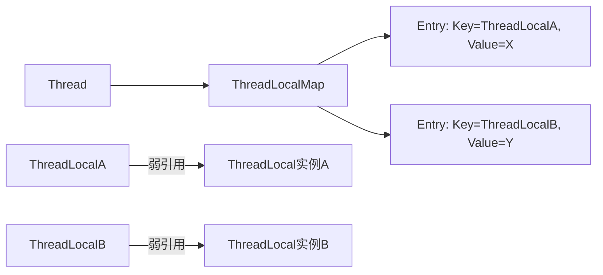

### **ThreadLocal 的本质（深入解析）**

ThreadLocal 是 Java 中用于实现 **线程封闭（Thread Confinement）** 的核心类，它的本质是 **让每个线程独立维护自己的变量副本**，避免多线程竞争。下面从 **底层实现、内存模型、应用场景、潜在问题** 四个方面深入解析。

---

## **1. ThreadLocal 的核心原理**
### **1.1 底层数据结构**
- **每个 Thread 内部维护一个 `ThreadLocalMap`**（类似简化版的 `HashMap`）。
- **Key**：`ThreadLocal` 实例本身（弱引用，防止内存泄漏）。
- **Value**：线程独有的变量值。

```java
// Thread 类的源码（简化）
public class Thread {
    ThreadLocal.ThreadLocalMap threadLocals; // 存储线程私有变量
}
```

### **1.2 读写流程**
- **`set(T value)`**  
  将当前 `ThreadLocal` 实例作为 Key，存入当前线程的 `ThreadLocalMap`。
  ```java
  public void set(T value) {
      Thread t = Thread.currentThread();
      ThreadLocalMap map = t.threadLocals;
      if (map != null) {
          map.set(this, value); // this 是 ThreadLocal 实例
      } else {
          createMap(t, value);
      }
  }
  ```

- **`get()`**  
  从当前线程的 `ThreadLocalMap` 中获取值。
  ```java
  public T get() {
      Thread t = Thread.currentThread();
      ThreadLocalMap map = t.threadLocals;
      if (map != null) {
          ThreadLocalMap.Entry e = map.getEntry(this);
          if (e != null) {
              return (T)e.value;
          }
      }
      return setInitialValue();
  }
  ```

---

## **2. ThreadLocal 的内存模型**
### **2.1 引用关系**


- **Key（ThreadLocal 实例）是弱引用**：  
  当外部强引用消失时（如 `ThreadLocal tl = null`），Key 会被 GC 回收，但 Value 仍存在（内存泄漏风险）。
- **Value 是强引用**：  
  必须手动调用 `remove()` 清理，否则线程池中复用的线程会导致 Value 堆积。

### **2.2 内存泄漏问题**
- **原因**：  
  - 线程池中的线程长期存活，`ThreadLocalMap` 中的 Entry 未被清除。
  - Key 是弱引用被回收后，Value 无法被访问，但依然占用内存。
- **解决方案**：  
  ```java
  try {
      threadLocal.set(value);
      // 业务逻辑...
  } finally {
      threadLocal.remove(); // 必须手动清理！
  }
  ```

---

## **3. ThreadLocal 的典型应用场景**
### **3.1 线程安全的工具类**
- **SimpleDateFormat**（非线程安全类）：
  ```java
  private static final ThreadLocal<SimpleDateFormat> dateFormat =
      ThreadLocal.withInitial(() -> new SimpleDateFormat("yyyy-MM-dd"));
  
  public static String format(Date date) {
      return dateFormat.get().format(date); // 每个线程有自己的实例
  }
  ```

### **3.2 全局上下文传递**
- **用户会话信息**（如 Spring 的 `RequestContextHolder`）：
  ```java
  public class UserContext {
      private static final ThreadLocal<User> currentUser = new ThreadLocal<>();
  
      public static void setUser(User user) {
          currentUser.set(user);
      }
  
      public static User getUser() {
          return currentUser.get();
      }
  }
  ```

### **3.3 数据库连接管理**
- **MyBatis 的 `SqlSessionHolder`**：  
  每个线程绑定独立的数据库连接，避免事务混乱。

---

## **4. ThreadLocal 的局限性**
### **4.1 父子线程隔离**
- **默认情况下，子线程无法继承父线程的 ThreadLocal 变量**。  
- **解决方案**：使用 `InheritableThreadLocal`（但线程池场景仍会失效）。

### **4.2 分布式系统不适用**
- **ThreadLocal 仅限单机多线程**，跨 JVM 需依赖 `RPC 上下文传递`（如 Dubbo 的 `RpcContext`）。

---

## **5. 总结**
- **本质**：通过线程内部的 `ThreadLocalMap` 实现变量隔离。
- **内存风险**：Key 是弱引用，Value 是强引用，必须调用 `remove()`。
- **适用场景**：线程安全工具类、上下文传递、资源隔离。
- **局限性**：不适用于父子线程池或分布式系统。

正确使用 ThreadLocal 可以显著减少锁竞争，但需谨慎处理生命周期！ 🚀

### **为什么 ThreadLocal 的 Key 是弱引用，而 Value 是强引用？**

ThreadLocal 的设计中，**Key（ThreadLocal 对象本身）使用弱引用**，而 **Value（存储的线程变量）是强引用**，主要是为了解决 **内存泄漏问题**，但同时也带来了新的挑战。下面从设计动机、内存模型和潜在问题三个方面详细解释：

------

## **1. 设计动机：防止 Key 泄漏**

### **(1) Key 为什么用弱引用？**

- **问题背景**：
   如果 Key 是强引用，即使业务代码中已经不再使用 `ThreadLocal` 对象（比如 `threadLocal = null`），但由于线程的 `ThreadLocalMap` 仍然持有该 Key 的强引用，会导致 `ThreadLocal` 对象无法被 GC 回收，从而引发内存泄漏。

  java

  复制

  ```java
  ThreadLocal<Object> threadLocal = new ThreadLocal<>();
  threadLocal.set("value");
  threadLocal = null; // 如果 Key 是强引用，ThreadLocal 对象仍然被 ThreadLocalMap 引用，无法回收！
  ```

- **解决方案**：
   ​**Key 设计为弱引用**，这样当外部强引用（`threadLocal = null`）消失时，Key 会被 GC 自动回收，避免 `ThreadLocal` 对象堆积。

  java

  复制

  ```java
  static class Entry extends WeakReference<ThreadLocal<?>> {
      Object value; // Value 是强引用
      Entry(ThreadLocal<?> k, Object v) {
          super(k); // Key 是弱引用
          value = v;
      }
  }
  ```

### **(2) Value 为什么是强引用？**

- 

  原因

  ：

  - 如果 Value 也是弱引用，那么即使线程还在运行，存储的数据可能会被 GC 意外回收，导致业务逻辑出错。

  - 例如：

    java

    复制

    ```java
    threadLocal.set(user);
    // 如果 Value 是弱引用，user 可能被 GC 回收，后续 threadLocal.get() 返回 null！
    ```

------

## **2. 内存模型分析**

### **(1) 引用关系**

mermaid

复制

```mermaid
graph LR
    Thread --> ThreadLocalMap
    ThreadLocalMap --> Entry1[Entry: Key=WeakRef(ThreadLocalA), Value=强引用X]
    ThreadLocalMap --> Entry2[Entry: Key=WeakRef(ThreadLocalB), Value=强引用Y]
    ThreadLocalA -->|弱引用| ThreadLocal实例A
    ThreadLocalB -->|弱引用| ThreadLocal实例B
```

### **(2) 内存泄漏的风险**

- **Key 被回收后，Value 仍然存在**：
   虽然 Key 是弱引用会被 GC 回收，但 Entry 中的 Value 仍然是强引用，如果线程长期存活（如线程池），这些 Value 会堆积，导致内存泄漏。

  java

  复制

  ```java
  threadLocal.set(new byte[1024 * 1024]); // 大对象
  threadLocal = null; // Key 被回收，但 Value 仍然占用内存！
  ```

- **解决方案**：
   必须 ​**手动调用 `remove()`**​ 清理 Entry：

  java

  复制

  ```java
  try {
      threadLocal.set(value);
      // 业务逻辑...
  } finally {
      threadLocal.remove(); // 强制清理 Value
  }
  ```

------

## **3. 为什么这样设计？权衡与折中**

### **(1) 设计者的权衡**

| **方案**                      | **优点**                  | **缺点**                       |
| ----------------------------- | ------------------------- | ------------------------------ |
| **Key 弱引用 + Value 强引用** | 避免 ThreadLocal 对象泄漏 | Value 需手动 `remove()` 清理   |
| **Key 强引用 + Value 强引用** | 无需手动清理              | ThreadLocal 对象永远无法回收   |
| **Key 弱引用 + Value 弱引用** | 完全自动清理              | 数据可能被意外回收，业务不安全 |

最终选择 **Key 弱引用 + Value 强引用**，因为：

1. 

   Key 泄漏比 Value 泄漏更严重

   ：

   - 一个 `ThreadLocal` 可能被多个线程使用，Key 泄漏会导致所有线程的 Map 堆积。
   - Value 泄漏仅限于单个线程，影响较小。

2. **业务代码可以控制 Value 的生命周期**（通过 `remove()`），但无法控制 Key 的泄漏。

### **(2) 类比：WeakHashMap 的设计**

- `WeakHashMap` 的 Key 也是弱引用，但 Entry 会在 Key 被回收后自动移除，而 `ThreadLocalMap` 没有这种机制（因为线程可能长期存活）。
- 所以 `ThreadLocal` 要求开发者 **必须手动清理**。

------

## **4. 最佳实践**

1. **始终在 

   ```
   finally
   ```

    中调用 

   ```
   remove()
   ```

   **：

   java

   复制

   ```java
   try {
       threadLocal.set(user);
       // 业务逻辑...
   } finally {
       threadLocal.remove(); // 必须清理！
   }
   ```

2. **避免存储大对象**：
    如果 Value 是大型缓存或集合，内存泄漏的影响会更严重。

3. **使用 `InheritableThreadLocal` 时更谨慎**：
    子线程会继承父线程的 `ThreadLocal` 变量，生命周期更长，泄漏风险更高。

------

## **总结**

- **Key 弱引用**：防止 `ThreadLocal` 对象本身泄漏（开发者忘记置 `null` 时也能被 GC 回收）。
- **Value 强引用**：保证数据安全，避免被 GC 意外回收。
- **代价**：需手动 `remove()` 清理 Value，否则线程池中可能内存泄漏。

这种设计是 **安全性（防止 Key 泄漏）** 和 **可控性（由开发者管理 Value）** 的折中方案。